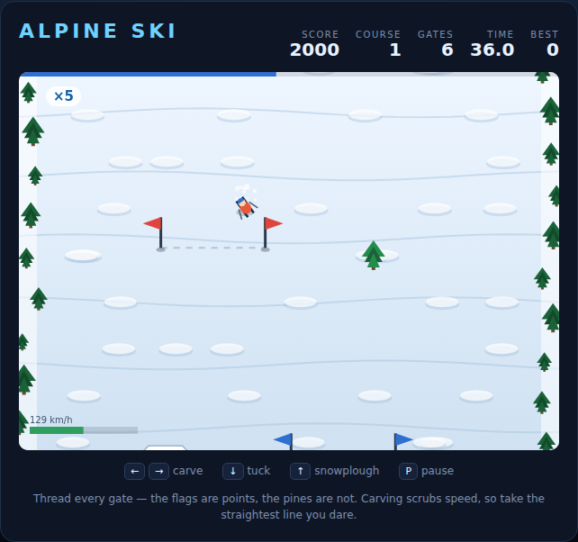

# Alpine Ski

A downhill slalom race, built with plain HTML5 canvas and JavaScript — no build
step, no dependencies. The mountain scrolls up past you while you carve between
the flags, dodge the pines and hunt for the ramps.

The catch is in the edges: the harder you turn across the hill, the more speed
you scrub. The fast line is the straight one, so every gate is a small bet on how
much time you can afford to spend on the turn.



## How to play

Open `index.html` in any modern browser. Press **Space** (or click **Start Run**)
to drop in.

| Key | Action |
|---|---|
| ← / → (or A / D) | Carve left / right |
| ↓ (or S) | Tuck for speed |
| ↑ (or W) | Snowplough — brake hard |
| Space | Start, take the next course, or restart |
| P / Esc | Pause / resume |

- **Gates** are the red and blue flag pairs. Cross the line between the flags and
  you score 100 points, doubled and tripled as your streak builds, up to ×5.
- **Miss a gate** — cross the line outside the flags — and the streak is gone and
  three seconds come off the clock.
- **Pines and rocks** put you face-down in the snow for just over a second, which
  on a tight course is worse than any penalty.
- **Ramps** launch you. In the air you fly straight over anything in your way and
  land with 120 points a second of air time. Steering up there barely works.
- **The clock** runs per course. Cross the line with time to spare and every
  second left is worth 25 points, on top of a 500-point finish bonus.
- Three courses, each longer, narrower and thicker with trees. Clear all three
  and you have won the mountain. Your best score is saved in the browser.

## Tips

- Start the turn early. Carving *at* the gate costs more speed than drifting into
  it on a shallow angle from 100 px up the hill.
- Tuck on the straight sections between gates, not through them — you cannot
  steer away from a pine at 260 px/s.
- A ramp is worth going slightly out of your way for: the air points are free and
  the tree line under you stops mattering.
- Losing the streak hurts more than losing the three seconds. A ×5 gate is 500
  points; rebuilding the streak from scratch takes five clean gates.

## Files

| File | What it is |
|---|---|
| `index.html` | page, HUD and overlay markup |
| `style.css` | the alpine palette and layout |
| `game.js` | the whole game: course generation, physics, rendering |
| `DESIGN.md` | how the code works, with the tuning numbers |
| `tests/alpine-ski.spec.js` | the Playwright suite (80 tests) |

## Tests

From the repository root:

```powershell
npx playwright test AlpineSki/tests/
```

The suite drives the simulation itself — it turns off the animation loop with
`setAutoStep(false)` and calls `step(dt)` frame by frame — so it is deterministic
and never waits on a wall clock.
