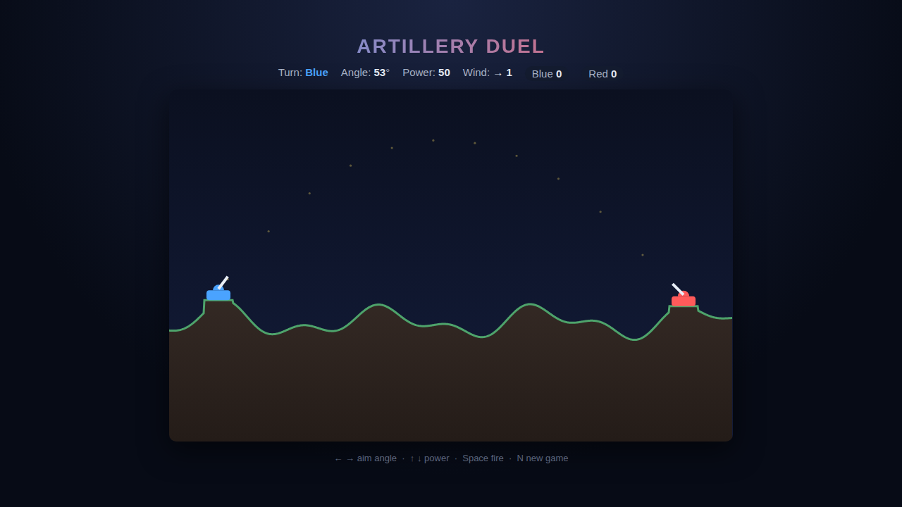

# Artillery Duel

A hot-seat, two-player artillery game. Two tanks face off across a randomly
generated, rolling battlefield. Take turns dialing in an **angle** and
**power**, account for the **wind**, and lob a shell at your opponent. A direct
hit wins the round. Miss, and you carve a crater while the turn passes to them.



## How to play

1. Open `index.html` in a browser (no server or build step needed).
2. Press **Start Duel** (or **Space**) to begin. Blue always shoots first.
3. Aim with the arrow keys, watch the dotted trajectory guide, then **fire**.
4. Land a shell on the enemy tank to score. First to bragging rights wins.

### Controls

| Input                | Action                    |
|----------------------|---------------------------|
| **← / →** or **A / D** | Aim: decrease / increase angle |
| **↑ / ↓** or **W / S** | Power: increase / decrease    |
| **Space** / **Enter**  | Fire the shell                |
| **N**                  | New game (fresh battlefield)  |

While a shell is in flight, aiming inputs are ignored. The **wind** indicator in
the HUD shows the direction and strength pushing your shell each round — it is
re-rolled every turn.

## Highlights

- **Deterministic physics core** — the whole flight is computed by a single pure
  function (`computeTrajectory`), so behaviour is reproducible and fully tested.
- **Destructible terrain** — every miss blasts a crater, reshaping the field.
- **Seeded terrain** — a battlefield seed always produces the same hills, which
  keeps the test suite reliable.

## Development

See [`DESIGN.md`](DESIGN.md) for the internal design and public API. Tests live
in [`tests/artillery.spec.js`](tests/artillery.spec.js) and run with the repo's
Playwright setup:

```powershell
npx playwright test Artillery/tests/
```
