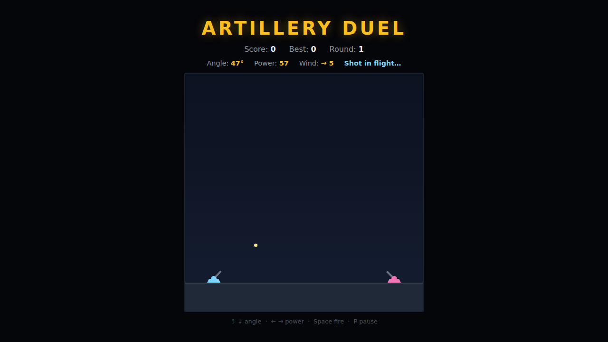

# Artillery Duel

A turn-based artillery duel in the spirit of *Scorched Earth* and QBasic
*Gorillas*. Your tank holds the left of the battlefield; a CPU tank holds the
right. Pick a barrel **angle** and a firing **power**, then lob a shell across
the field. Gravity bends every shot into a parabola and a per-round **wind**
pushes it sideways — read both and drop a shell right on the enemy tank.



## How to play

- **↑ / ↓** — raise / lower the barrel angle.
- **← / →** — decrease / increase firing power.
- **Space** — fire. On the title or game-over screen, Space (or any arrow) starts a new duel.
- **P** — pause / resume.

Each turn only one shell is ever in the air. Land a hit on the CPU to **win the
round** — your score and the round counter climb and the wind is re-rolled. Miss
and the CPU takes its shot; if it lands one on you, the duel is over. Your best
score is saved between sessions.

## Reading the shot

The readout above the field shows your current **Angle**, **Power** and the
round's **Wind** (an arrow and a strength from 0–9, or `calm`). The wind blows
the shell the whole way across, so a strong tailwind means less power; a
headwind means more. At the default 45° a little more or less power walks the
impact point toward or away from the target.

## Tips

- Start near **45°** and adjust power first — it changes range the most.
- Watch where your last shell landed and nudge power a step or two toward the
  enemy; the flat ground makes the correction predictable.
- Account for the wind arrow before firing into a strong breeze.

## Running the tests

From the repo root:

```powershell
npx playwright test ArtilleryDuel/tests/
```

See [DESIGN.md](DESIGN.md) for how the code is structured, the ballistics model,
and the CPU aiming heuristic.
