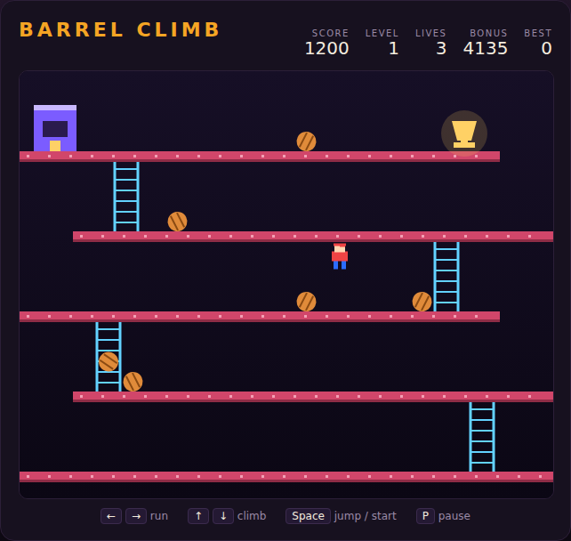

# Barrel Climb

A girder-and-ladder climbing arcade game, built with plain HTML5 canvas and
JavaScript — no build step, no dependencies. A machine at the top of the scaffold
spits out barrels that zig-zag down the girders; you run, jump and climb your way
from the bottom floor to the prize at the top without getting flattened.



## How to play

Open `index.html` in any modern browser. Press **Space** (or click **Start
Game**) to begin.

| Key | Action |
|---|---|
| ← / A | Run left |
| → / D | Run right |
| ↑ / W | Climb up a ladder |
| ↓ / S | Climb down a ladder |
| Space | Jump (start / restart when the overlay is up) |
| P | Pause / resume |

- Get to the **trophy** at the right-hand end of the top floor. The ladders
  zig-zag, so your route does too.
- **Hurdle a barrel** by jumping as it rolls under you — that's **100 points**
  each, and it's often faster than waiting for a gap.
- Barrels reverse direction each time they drop to a new girder, and they
  sometimes take a **ladder** down early — a clear-looking girder can stop being
  clear.
- The **bonus** starts at 5000 and drains while you climb; reaching the trophy
  banks whatever is left. Dawdle and you'll bank nothing.
- Touching a barrel costs one of your **3 lives** and puts you back at the bottom
  of the same level with a fresh bonus.
- Clearing a level speeds the barrels up and shortens the gap between drops.
- Your best score is saved in the browser's `localStorage`.

Walking off the open end of a girder is legal — you'll drop to the girder below,
which is sometimes the quickest way to reset a bad position.

## Development

Barrel Climb follows the repo-wide test setup. From the repository root:

```powershell
npm install
npx playwright install chromium
npx playwright test BarrelClimb/tests/
```

The 63 tests drive the simulation directly through `step(dt)` and assert on game
state, so they run fast and don't depend on frame timing.

See [DESIGN.md](DESIGN.md) for how the code is put together.
