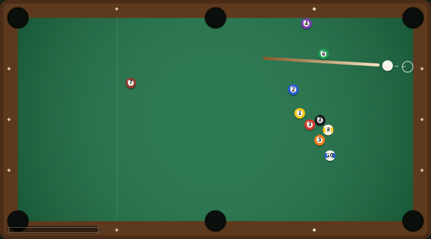

# Billiards

A top-down pool table, built with plain HTML5 canvas and JavaScript — no build
step, no dependencies. Break the rack, pot the nine colours in any order, then
sink the black **8** to clear the table and rack up a fresh one. Pot the 8 too
early and the run is over.



## How to play

Open `index.html` in any modern browser. Press **Space** (or click **Start
Game**) to begin.

| Input | Action |
|---|---|
| Mouse move | Aim the cue at the pointer |
| Mouse hold / release | Charge the power meter, release to shoot |
| Space hold / release | Charge and shoot (also starts the game) |
| ← / → | Fine-tune the aim |
| ↑ / ↓ | Nudge the power meter |
| R | New game |

- A dashed guide line and a ghost ball show where the cue ball will make
  contact, so you can plan cuts and cushion shots.
- Each colour you pot is worth **100 points**.
- Potting the cue ball is a **scratch**: it costs a **50 point** foul and the cue
  ball is respotted on the head spot.
- Clear all nine colours, then pot the **8** for a **300 point** rack bonus and a
  fresh rack — racks keep coming, so the score keeps climbing.
- Pot the **8** while colours are still on the table and the game ends.
- Your best score is saved in the browser's `localStorage`.

## Development

Billiards follows the repo-wide test setup. From the repository root:

```powershell
npm install
npx playwright install chromium
npx playwright test Billiards/tests/
```

See [DESIGN.md](DESIGN.md) for the physics model — friction, cushion restitution
and the equal-mass collision response — and for how the simulation is made
deterministic for testing.
