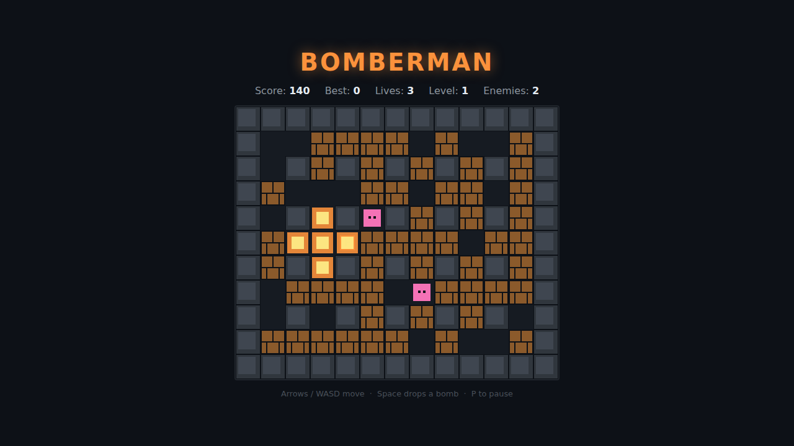

# Bomberman

A self-contained HTML5 canvas take on the classic **Bomberman**. Navigate a
grid maze, drop bombs to blow up the soft bricks (and the enemies wandering
them), grab the power-ups you uncover, and clear every enemy to reach the next
level — without getting caught in your own blast.



## How to play

Open `index.html` in any modern browser — no build step or server required.

### Controls

| Action           | Keys                       |
|------------------|----------------------------|
| Move             | Arrow keys or **W A S D**  |
| Drop bomb        | **Space**                  |
| Pause / resume   | **P**                      |
| Start / restart  | **Space** or an arrow key  |

### Goal

The maze is a 13 × 11 grid. The outer ring and the evenly-spaced interior
pillars are **indestructible walls**; the brown **bricks** can be blown up.

- Drop a bomb with **Space**. After a 2-second fuse it explodes in a `+` shape,
  reaching `range` tiles in each direction. A wall stops the blast; a brick
  stops it *and* is destroyed.
- A blast that reaches another bomb sets it off too (**chain reactions**).
- Some bricks hide a **power-up**, revealed when they're destroyed. Walk over it
  to collect it:
  - 🔥 **Flame** — blast reaches one tile further.
  - 💣 **Extra Bomb** — carry one more bomb at a time.
- Blow up every **enemy** to clear the level; each new level rebuilds the maze
  with more of them. But touching an enemy — or standing in a blast — costs a
  life.

**Scoring:** brick **+10**, power-up **+50**, enemy **+100**.

You start with **3 lives**; a hit respawns you at the corner with a brief
moment of invulnerability (you blink). At 0 lives it's game over. Your best
score is saved in the browser via `localStorage`.

## How it works

See [DESIGN.md](DESIGN.md) for the full concept, mechanics, and implementation
notes. In short:

- **`index.html`** — the HUD, the `<canvas>`, and the start/pause/game-over
  overlay.
- **`style.css`** — the neon-on-dark look shared with the other games here.
- **`game.js`** — all game logic. Every timer (fuses, blast lifetimes, move
  cooldowns, invulnerability) is integrated against real elapsed time by a
  single `step(dt)` function, kept separate from `draw()`, so the game is
  frame-rate independent and fully testable. State and helpers live on the
  global scope so the Playwright suite can set the grid and place bombs/enemies
  at exact tiles — no test depends on `Math.random`. The brick layout and enemy
  wandering used in real play come from a **seeded** PRNG, so levels are
  reproducible.

## Tests

Playwright specs live in `tests/bomberman.spec.js`. From the repo root:

```powershell
npx playwright test Bomberman/tests/
```
