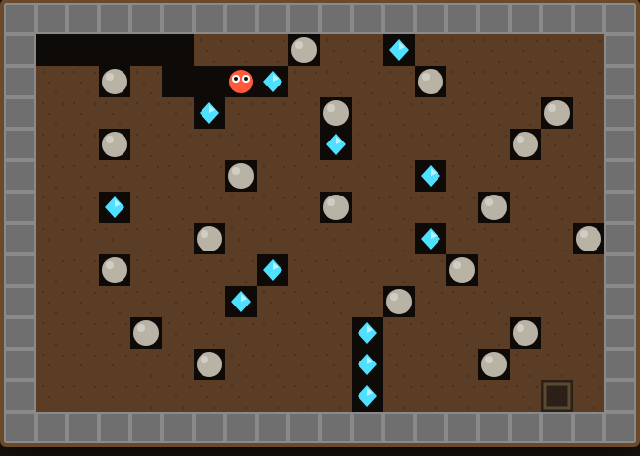

# Boulder Dash

A dig-and-collect underground arcade game built with HTML5 Canvas. Tunnel
through the earth, scoop up diamonds, and reach the exit — without letting a
falling boulder land on your head.

## How to Play

Open `index.html` in any modern browser — no build step, no dependencies.

| Input | Action |
|---|---|
| ← ↑ ↓ → arrows (or W A S D) | Move / dig in that direction |
| ← / → into a boulder | Push it sideways (if there's room behind it) |
| P | Pause / resume |
| Space / Start button | Start or restart |

**Objective:** Dig through the brown **dirt** to move around. Collect
**diamonds** (cyan) to raise your count — once you reach the target shown in
the HUD, the **exit** unlocks. Reach the open exit to escape and win.

**Boulders:** Grey **boulders** don't fall while something solid holds them up
(dirt, a wall, another boulder). But dig the ground out from under one and it
**falls** — and a boulder that falls onto you is fatal. You can also **push**
a boulder sideways into an empty space to clear a path or set up a trap.

**Rolling:** A boulder (or diamond) resting on top of another rounded object
will **roll off** to the side if there's an empty gap there — so stacks don't
stay balanced forever.

**Best:** Your best score is saved in `localStorage` and shown as **Best**, so
your personal record persists between sessions.

See [design.md](design.md) for how the code works.
