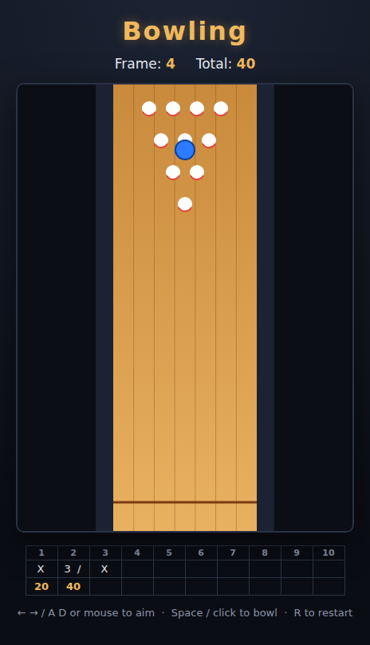

# Bowling

Ten-pin bowling on an HTML5 canvas, viewed top-down. Line up your aim, bowl,
and knock the pins down with a deterministic cascade. A full ten-frame game is
scored with real strike/spare rules on a live scorecard. Go for **300**.



## How to play

1. Press **Start** (or click / Space).
2. Slide the aim marker with **← / →** (or the mouse) across the lane. The
   dashed guide shows the ball's path.
3. **Bowl** with **Space** or a click. The ball rolls straight up the lane; pins
   in its path fall and knock over their neighbours.
4. Each frame gives two balls (three in the 10th if you strike or spare).
   Standard scoring applies:
   - **Strike** — 10 + your next two balls.
   - **Spare** — 10 + your next one ball.
   - **Open frame** — the pins you knocked down.
5. A centred shot finds the pocket for a strike; drift toward the edge and
   you'll leave pins — or find the gutter.

## Controls

| Input | Action |
|---|---|
| ← / → or A / D or mouse | Aim |
| Space / click | Bowl (and start from the overlay) |
| R | Restart |

## Development

Open `index.html` directly in a browser — no build step required.

Tests use Playwright and live in `tests/`. From the repo root:

```powershell
npx playwright test Bowling/tests/
```

See [DESIGN.md](DESIGN.md) for the design, the pure scoring/physics core, and
the assumptions made.
