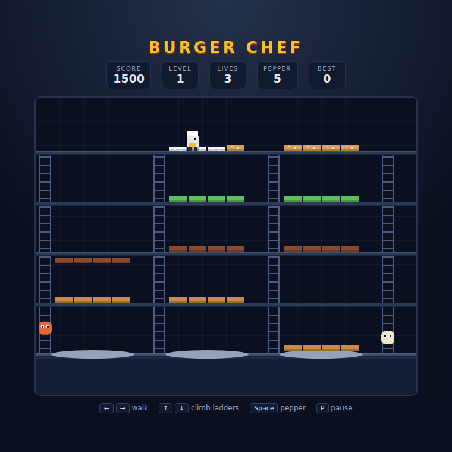

# Burger Chef

A BurgerTime-style platform arcade game on an HTML5 canvas. Walk across burger
ingredients to knock them down onto the plates, dodge the food that is chasing
you, and freeze it with pepper when it gets too close.



## Playing

Open `index.html` in a browser — no build step or server required.

## How to play

Three burgers sit stacked across five floors joined by ladders. Walking the full
width of an ingredient flips it down to the floor below. An ingredient that
lands on one that is already resting knocks that one down too, so a clean drop
from the top bun can cascade a whole burger onto the plate in one go.

Hot dogs, eggs and pickles hunt you down. Touching one costs a life. You start
with five shakes of pepper: a spray freezes anything on your floor just in front
of you for a few seconds. Drop an ingredient on an enemy and it is flattened —
and the extra weight carries the ingredient an extra floor down.

Assemble all three burgers to clear the level. Each new level adds faster and
more numerous enemies.

## Controls

| Input | Action |
|---|---|
| `←` `→` or `A` `D` | Walk |
| `↑` `↓` or `W` `S` | Climb a ladder |
| `Space` | Spray pepper (also starts a new game) |
| `P` | Pause / resume |

## Scoring

| Event | Points |
|---|---|
| Ingredient dropped a floor | 50 |
| Enemy squashed | 100 |
| Burger completed | 500 |
| Level cleared | 1000 |

Your best score is saved in the browser.

## Development

See [DESIGN.md](DESIGN.md) for how the code is put together.

Run the tests from the repository root:

```powershell
npx playwright test BurgerChef/tests/
```
