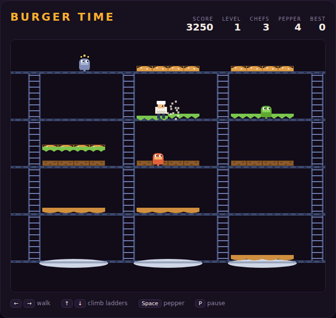

# Burger Time

Build three giant hamburgers by stomping their ingredients down a maze of
platforms and ladders — while the food fights back.



## How to play

Open `index.html` in any browser. No build step, no server.

Walk across an ingredient and each segment you cross is stamped down. Stamp all
four segments and the ingredient drops to the platform below — and anything it
lands on drops with it. Get all twelve ingredients onto the plates at the bottom
to finish the level.

A hot dog, a pickle and a fried egg chase you through the maze. Touch one and
you lose a chef. When they get too close, hit them with a puff of pepper: they
freeze long enough for you to walk right past. You only get five puffs per life,
so save them.

Drop an ingredient on an enemy and it is squashed for a fat 500 points.

## Controls

| Input | Action |
|---|---|
| ← / → or A / D | Walk |
| ↑ / ↓ or W / S | Climb a ladder |
| Space | Spray pepper (also starts / restarts the game) |
| P | Pause / resume |

## Scoring

| Event | Points |
|---|---|
| Ingredient dropped a floor | 50 |
| Ingredient plated | 100 |
| Enemy squashed | 500 |
| Level completed | 1000 × level |

Each level the enemies get faster and more of them prowl the maze. Your best
score is kept in the browser.

## Tests

```powershell
npx playwright test BurgerTime/tests/
```

See [DESIGN.md](DESIGN.md) for how the code is put together.
