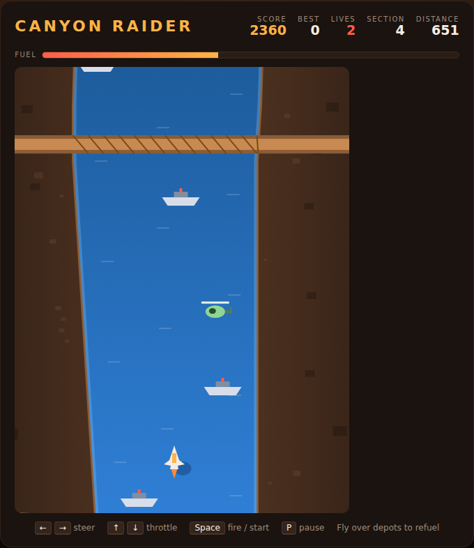

# Canyon Raider

A vertically scrolling flight shooter built with plain HTML5 canvas and
JavaScript — no build step, no dependencies. Fly a jet up a winding river
canyon, shoot the traffic in your way, and keep the tank alive by skimming the
fuel depots moored in the water. Every section of the canyon is sealed by a
bridge; blow it up and the next one opens, faster and busier.



## How to play

Open `index.html` in any modern browser. Press **Space** (or click **Start
Run**) to take off.

| Key | Action |
|---|---|
| ← / A | Steer left |
| → / D | Steer right |
| ↑ / W | Throttle up |
| ↓ / S | Throttle down |
| Space | Fire — and start / restart a run |
| P | Pause / resume |

## Rules

- The **canyon walls are solid**. So are gunboats, helicopters and bridges —
  touching any of them costs one of your three lives.
- **Fuel drains constantly**, and faster the harder you push the throttle. Fly
  *over* an orange **fuel depot** to fill the tank. Running dry is a crash —
  below a quarter tank the gauge flashes and the canyon warns you.
- You can **shoot a depot** for 80 points, but then you cannot drink from it —
  a bad trade when the gauge is low.
- **Bridges seal each section.** Destroying one scores 500, advances the section
  counter, and speeds the canyon up a notch.
- The **throttle is the risk dial**: more speed means more distance and more
  score per minute, but less time to read the river and a thirstier engine.

| Target | Score |
|---|---|
| Gunboat | 30 |
| Helicopter | 60 |
| Fuel depot | 80 |
| Bridge | 500 |

Your best score is saved in the browser's `localStorage`.

## Development

Canyon Raider follows the repo-wide test setup. From the repository root:

```powershell
npm install
npx playwright install chromium
npx playwright test CanyonRaider/tests/
```

The 47 specs in `tests/canyonraider.spec.js` drive the game through its globals
(`step`, `startGame`, `plane`, `entities`, `fuel`, …) and seed the canyon so
every run is reproducible. See [DESIGN.md](DESIGN.md) for how the world model,
canyon generation and collision handling work.
