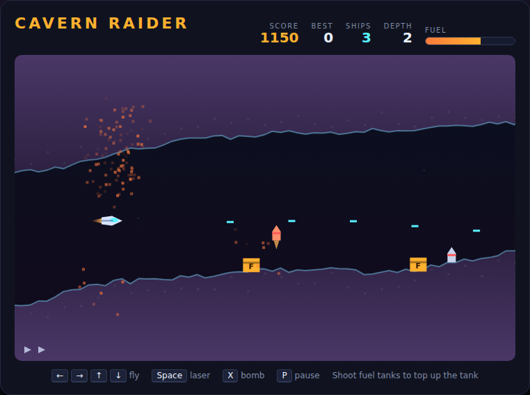

# Cavern Raider

A side-scrolling cave flight, built with plain HTML5 canvas and JavaScript — no
build step, no dependencies. Fly a scout ship through an endless winding cave
that tightens and speeds up the deeper you go. The rock wrecks you on contact,
missile bases launch at you from the floor, and your fuel is always running
out — the only way to top it up is to blow up the fuel tanks stashed along the
cave floor.

Inspired by the 1981 Konami classic *Scramble*.



## How to play

Open `index.html` in any modern browser. Press **Space** (or click **Launch**)
to begin.

| Key | Action |
|---|---|
| ← / → / ↑ / ↓ | Fly the ship |
| A / D / W / S | Fly the ship |
| Space | Fire the laser (start / restart when idle or after a game over) |
| X or B | Drop a bomb |
| P | Pause / resume |

- **Don't touch the rock.** The cave is jagged and it closes in — what you see is
  exactly what wrecks you.
- **Shoot the fuel tanks.** Every tank is 26 units of fuel and 30 points. A full
  tank is about 38 seconds of flight, so skipping tanks is what actually ends
  most runs.
- **Missile bases** wake up when you get within about 300 px and climb after you.
  Kill them early — they're 50 points each.
- **Bombs** arc forward and down. Use them for targets tucked under a low roof
  that the laser can't get level with.
- **Depth** climbs every 2400 px flown. Each level makes the cave faster *and*
  narrower.
- You get 3 ships. A crash costs one and the cave picks up where it stopped, with
  a fresh tank. Your best score is saved in the browser's `localStorage`.

## Development

Cavern Raider follows the repo-wide test setup. From the repository root:

```powershell
npm install
npx playwright install chromium
npx playwright test CavernRaider/tests/
```

`DESIGN.md` explains how the cave generator and the simulation work.
