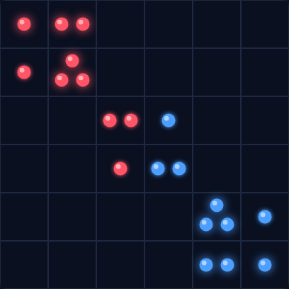

# Chain Reaction

A two-player hotseat strategy game of explosive cascades. Drop orbs into cells;
when a cell fills past its neighbour count it **explodes**, flinging an orb into
each neighbour and **capturing** them. Explosions set off more explosions —
a single well-placed orb can flip the whole board from one colour to the other.
Wipe out your opponent's orbs to win.



## How to play

- **Red** and **Blue** take turns (same mouse). Red moves first.
- Click any **empty** cell or a cell **you already own** to drop an orb in it.
  You can't drop into a cell your opponent owns.
- Each cell's **critical mass** equals its number of orthogonal neighbours:
  **2** in the corners, **3** on the edges, **4** in the middle.
- Fill a cell to its critical mass and it explodes: one orb goes to each
  neighbour and those cells become yours — potentially detonating them too, in a
  chain reaction.
- Capture **every** orb on the board (after both players have moved at least
  once) and you win.

## Controls

| Input | Action |
|-------|--------|
| Mouse click | Drop an orb in the clicked cell |
| `R` | New game |
| New Game button | New game |

## Strategy tips

- Cells next to your opponent's near-critical cells are dangerous — one
  explosion can capture them.
- Corners (critical mass 2) explode quickly and are strong footholds.
- Set up your own chains: a line of near-critical cells can cascade across the
  board in a single move.

## Running

Open `index.html` directly in any modern browser — no build step or server
required.

## Development

See [DESIGN.md](DESIGN.md) for the concept, rules, and implementation notes.
Tests live in `tests/` and run with Playwright from the repo root:

```
npx playwright test ChainReaction/tests/
```
