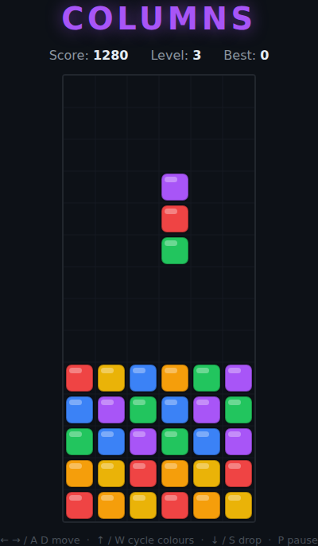

# Columns

A falling-jewel puzzle on an HTML5 canvas, inspired by the 1990 Sega classic.
Jewels drop from the top in vertical groups of three. Slide the group and
**cycle** the order of its colours, then let it land. Line up three or more of
the same colour — horizontally, vertically, **or diagonally** — and they vanish,
everything above collapses to fill the gap, and any fresh lines clear too,
chaining for bonus points. Keep the board from stacking to the top.

Unlike the swap-based matchers elsewhere in this repo, Columns is a
**falling-piece stacker**: you place a descending triple and the whole board
reacts.



## How to play

Open `index.html` directly in a browser — no build step or server needed.

### Controls

| Action | Keys |
|---|---|
| Move left / right | **←** / **→** or **A** / **D** |
| Cycle the group's colours | **↑** or **W** |
| Soft drop | **↓** or **S** |
| Start | **Space**, an arrow key, or the **Start** button |
| Pause / resume | **P** |

### Rules

- Jewels fall as a vertical group of three. **Cycle** rotates the three colours
  within the group (the bottom jewel wraps to the top) so you can arrange them
  before they land.
- Three or more of the same colour in a line — in **any** direction, including
  diagonals — clear from the board.
- When jewels clear, everything above **collapses** down to fill the gap. If
  that forms a new line, it clears too: a **cascade**, and later links in a
  cascade are worth more points.
- Each cleared jewel counts toward the **level**, which rises every 30 jewels.
  Higher levels make the groups fall faster.
- If a new group can't enter at the top, the game is over.
- Your best score is saved in the browser via `localStorage`.

## Files

| File | Purpose |
|---|---|
| `index.html` | Page markup, canvas, and HUD |
| `style.css` | Styling and the start / pause / game-over overlay |
| `game.js` | Board model, group logic, matching/cascades, rendering, and input |
| `DESIGN.md` | Design notes: concept, mechanics, and assumptions |
| `tests/columns.spec.js` | Playwright test suite |

## Development

From the repository root:

```powershell
npm install
npx playwright test Columns/tests/
```

See the root [README](../README.md) for full setup instructions.
