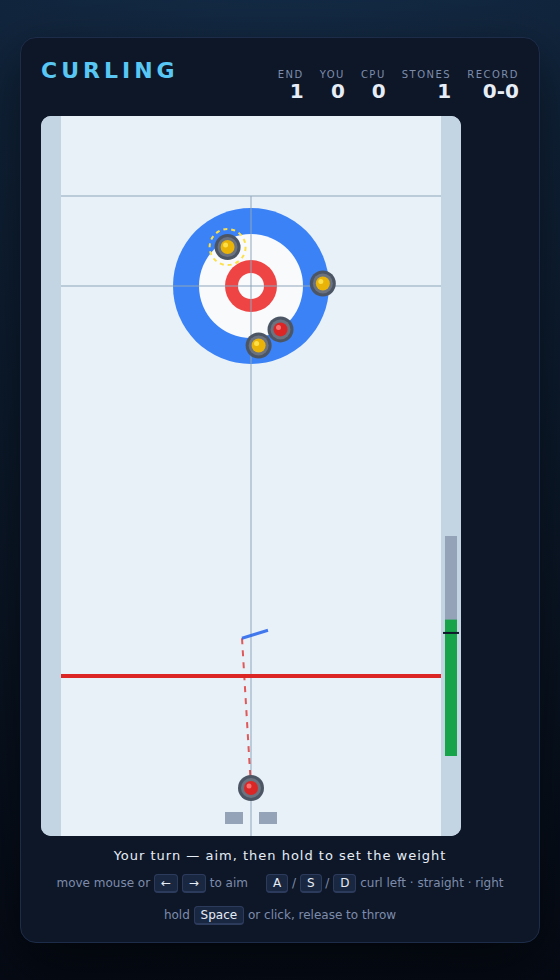

# Curling

A match of curling against a CPU opponent, built with plain HTML5 canvas and
JavaScript — no build step, no dependencies. Slide your stones up the sheet of
ice and try to finish the end with the rocks nearest the **button**, the centre
of the target rings. Stones curl sideways as they slow down, and smash each
other out of play when they meet.



## How to play

Open `index.html` in any modern browser. Press **Space** (or click **Start
Game**) to begin.

| Input | Action |
|---|---|
| Mouse move | Aim your line at the pointer |
| ← / → | Nudge the line left / right |
| A / S / D | Handle: curl left · straight · curl right |
| Hold Space or the mouse button | Charge the power meter |
| Release | Deliver the stone |
| Space on the overlay | Start · next end · play again |

### The throw

Every delivery is three decisions:

- **Line** — the angle you aim, up to about 12° either side of straight.
- **Weight** — how hard you throw it. The power meter sweeps up and back down
  while you hold the button, so you have to release at the right moment. The
  black tick on the meter marks the weight that draws to the button.
- **Handle** — the curl. `D` bends the stone right as it slows, `A` bends it
  left, `S` throws it straight. The bend arrives late, so a handle is how you
  get around a guard.

### The rules

- Each team throws **4 stones** per end; you are red, the CPU is yellow.
- A delivered stone must finish **past the hog line** (the thick red line) or it
  is removed. Stones knocked over a side line or past the back line are removed
  too.
- At the end of an end, the team with the stone closest to the button **scores
  one point for every stone it has closer than the opponent's best**. Stones
  outside the rings never count. An empty house is a blank end.
- The **hammer** — the last stone of an end — starts with the CPU and then goes
  to whoever conceded the previous end. It is worth having: the last stone often
  decides the count.
- A match is **4 ends**. Level scores go to extra ends until someone leads.
- Your win/loss record is saved in the browser's `localStorage`.

The dashed ring on the sheet marks the **shot rock** — the stone currently
counting.

## Development

Curling follows the repo-wide test setup. From the repository root:

```powershell
npm install
npx playwright install chromium
npx playwright test Curling/tests/
```

See [DESIGN.md](DESIGN.md) for how the physics, scoring and CPU opponent work,
and how the simulation is made deterministic for testing.
