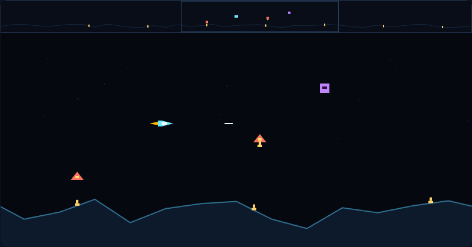

# Defender

A wrap-around scrolling shooter built with plain HTML5 canvas and JavaScript —
no build step, no dependencies. You fly the last ship over a planet three
screens wide while alien landers try to carry off the eight humanoids living on
the surface. A radar strip across the top shows the whole planet at once, so
most of your decisions are made about things you cannot currently see.



## How to play

Open `index.html` in any modern browser. Press **Space** (or click **Start
Game**) to begin.

| Key | Action |
|---|---|
| ← / A | Thrust left (the ship turns to face left) |
| → / D | Thrust right |
| ↑ / W | Climb |
| ↓ / S | Dive |
| Space | Start / restart — and fire while playing |
| B | Smart bomb |
| P | Pause / resume |

## The rules

- **Landers** descend on the humanoids. A lander that grabs one hauls it toward
  the top of the sky; if it gets there, the humanoid is gone and the lander
  becomes a **mutant** — faster, aggressive, and aimed squarely at you.
- **Shoot a carrying lander** and the humanoid drops. Fly into it to catch it,
  then skim low over the ridge to set it down: **500 points**.
- A humanoid that hits the ground too fast dies. Catch it high, or shoot the
  lander before it climbs.
- **Smart bombs** wipe out every alien on screen. You start with three and earn
  one per wave, up to six.
- Clear a wave to bank **100 points per surviving humanoid**. Each wave sends
  more landers than the last.
- Touching an alien or its plasma costs a ship. You get three, and a couple of
  seconds of invulnerability each time you re-materialise.
- Lose every humanoid and the planet falls: the remaining landers all mutate at
  once, and no humanoids come back.

## Reading the radar

The strip along the top is the whole 2400-px-wide world compressed into 800 px,
always centred on your ship. Yellow ticks are humanoids, red blocks are landers,
purple blocks are mutants, and the outlined box is the slice of world currently
on screen. A red block drifting upward on the radar is a lander with a humanoid
— that is the one worth crossing the planet for.

## Scoring

| Event | Points |
|---|---|
| Lander destroyed | 150 |
| Mutant destroyed | 150 |
| Humanoid rescued and set down | 500 |
| Humanoid alive at the end of a wave | 100 |

Your best score is kept in `localStorage`.

## Development

The game is three files: `index.html`, `style.css` and `game.js`. See
[DESIGN.md](DESIGN.md) for how the code is put together.

Tests live in `tests/` and run from the repo root:

```powershell
npx playwright test Defender/tests/
```
