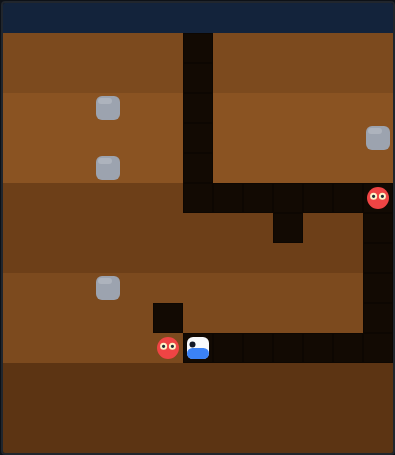

# Dig Dug

A digging arcade game on an HTML5 canvas. You tunnel through solid earth while
underground monsters hunt you down. Clear every monster to advance — pop them
with your inflator harpoon or drop rocks on them by digging away the ground
beneath.



## How to play

Open `index.html` directly in a browser — no build step or server needed.

### Controls

| Action | Keys |
|---|---|
| Move / dig | **Arrow keys** or **W A S D** |
| Fire / pump the harpoon | **Space** |
| Start | **Space**, an arrow key, or the **Start** button |
| Pause / resume | **P** |

### Rules

- The digger moves one cell at a time and **carves a tunnel** through any soil it
  enters. It can't move off the grid or into a rock.
- **Monsters** hunt you. They take the shortest path through existing tunnels;
  if you seal them off with earth for too long, they briefly **ghost** — slipping
  a cell straight through the soil toward you. A monster that reaches you costs a
  life.
- **The harpoon:** face a monster and press Space to grab the nearest one in
  line (up to a few cells, through open tunnel only). Keep pumping to inflate it
  — enough pumps and it **pops**. Stop pumping and it deflates and breaks free.
  An inflating monster is frozen in place.
- **Falling rocks:** dig out the cell directly beneath a rock and it drops a
  moment later, **crushing** any monster (or you) in its path before it shatters.
  Rocks are worth big points and can take out several monsters at once.
- **Clear the screen** of monsters to reach the next, busier level. Score and
  lives carry over.
- You start with three lives. Losing the last one ends the game. Your best score
  is saved in the browser via `localStorage`.

## Files

| File | Purpose |
|---|---|
| `index.html` | Page markup, canvas, and HUD |
| `style.css` | Styling and the start / pause / game-over overlay |
| `game.js` | Grid model, digging, monsters, rocks, harpoon, rendering, input |
| `DESIGN.md` | Design notes: concept, mechanics, and assumptions |
| `tests/digdug.spec.js` | Playwright test suite |

## Development

From the repository root:

```powershell
npm install
npx playwright test DigDug/tests/
```

See the root [README](../README.md) for full setup instructions.
