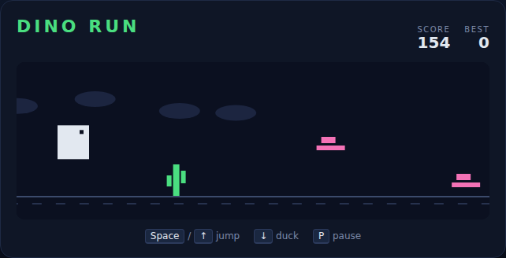

# Dino Run

An endless side-scrolling runner, built with plain HTML5 canvas and JavaScript —
no build step, no dependencies. A little dinosaur sprints across the desert while
cacti and birds rush in from the right. Jump the cacti, duck under the birds, and
keep running — the world speeds up the longer you last.



## How to play

Open `index.html` in any modern browser. Press **Space** (or **↑**, or click
**Start Game**) to begin.

| Key | Action |
|---|---|
| Space / ↑ / W | Jump — and start / restart the run |
| ↓ / S | Duck (hold) to slip under birds |
| P | Pause / resume |

- You can't double-jump — you must be back on the ground to jump again.
- Ducking shrinks the dino so it fits under low-flying birds; ducking in mid-air
  drops you back down faster.
- The world scrolls faster as you go, so later obstacles arrive quicker.
- Your score is the distance travelled; your best score is saved in the
  browser's `localStorage`.

The run ends the moment the dino hits an obstacle.

## Development

Dino Run follows the repo-wide test setup. From the repository root:

```powershell
npm install
npx playwright install chromium
npx playwright test DinoRun/tests/
```

See [DESIGN.md](DESIGN.md) for how the code is structured and how the physics is
made deterministic for testing.
