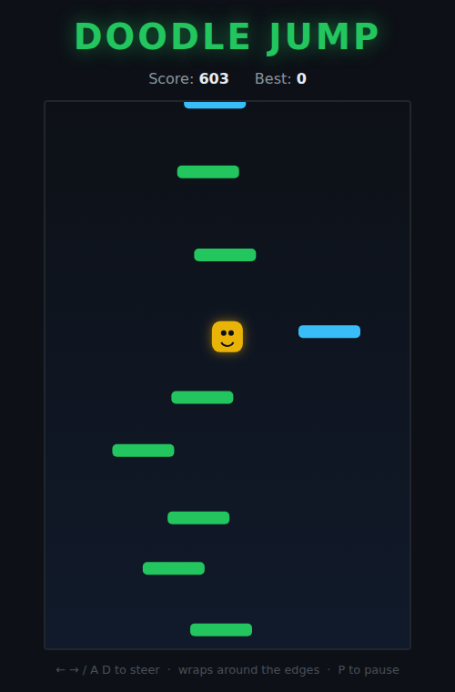

# Doodle Jump

An endless vertical jumper on an HTML5 canvas. Your character bounces forever —
you just steer left and right. Land on platforms to keep climbing; the higher
you go, the higher your score. Miss and fall off the bottom, and it's over.



## How to play

Open `index.html` directly in a browser — no build step or server needed.

### Controls

| Action | Keys |
|---|---|
| Steer left / right | **←** / **→** or **A** / **D** |
| Start | **Space**, **←**, **→**, **A**, **D**, or the **Start** button |
| Pause / resume | **P** |

### Rules

- The character bounces automatically. Every bounce reaches the same height, so
  the game is all about steering onto the next platform.
- Move off one edge of the screen to **wrap around** to the other side.
- Platforms come in three kinds:
  - **Green** — normal, solid, static.
  - **Cyan** — solid but drifts sideways, reversing at the walls.
  - **Brown** — breaks the instant you touch it: no bounce, you fall straight
    through. A safe green platform is always generated alongside it, so a
    break is a trap to avoid, never a dead end.
- The world scrolls only once you climb past the camera line (40% from the
  top). **Your score is the total height climbed**, in pixels, and it never
  goes down.
- Falling below the bottom of the screen ends the run.
- Your best score is saved in the browser via `localStorage`.

## Files

| File | Purpose |
|---|---|
| `index.html` | Page markup, canvas, and HUD |
| `style.css` | Styling and the start / pause / game-over overlay |
| `game.js` | Game logic, physics, platform generation, rendering, and input |
| `DESIGN.md` | Design notes: concept, mechanics, and assumptions |
| `tests/doodlejump.spec.js` | Playwright test suite |

## Development

From the repository root:

```powershell
npm install
npx playwright test DoodleJump/tests/
```

See the root [README](../README.md) for full setup instructions.
