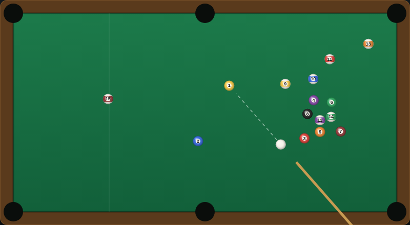

# 8-Ball Pool

Two-player hot-seat 8-ball on a six-pocket table, drawn on an HTML5 canvas with
no libraries and no build step. Open `index.html` in a browser and play.



## How to play

Player 1 breaks. The table starts **open** — neither player owns a group yet.
The first legal pot decides it: pot a solid and you are solids (1–7), pot a
stripe and you are stripes (9–15); your opponent gets the other group.

Keep potting your own balls to stay at the table. Once every ball in your group
is gone you are on the 8-ball — pot it legally and you win the rack.

### Fouls

A foul hands the incoming player **ball in hand**: they may pick the cue ball up
and place it anywhere on the table before shooting.

- the cue ball hits no ball at all,
- the cue ball's first contact is not one of your own balls (on an open table
  anything but the 8-ball is fine),
- you pot the cue ball (a scratch).

### Winning and losing

- Pot the 8-ball once your group is cleared, without fouling → **you win**.
- Pot the 8-ball at any other time — too early, or while fouling → **you lose**.

## Controls

| Input | Action |
|---|---|
| Move the mouse | aim the cue at the pointer |
| Hold the mouse button or <kbd>Space</kbd> | charge the power meter |
| Release | take the shot |
| <kbd>←</kbd> <kbd>→</kbd> | fine-tune the aim |
| <kbd>↑</kbd> <kbd>↓</kbd> | fine-tune the power |
| Click (with ball in hand) | place the cue ball |
| <kbd>R</kbd> | rack a new game |

The dashed line shows where the cue ball is headed, stopping at the first ball
or cushion in its path.

## Files

| File | What it holds |
|---|---|
| `index.html` | page layout, HUD and canvas |
| `style.css` | table-side styling |
| `game.js` | physics, rules engine and rendering |
| `DESIGN.md` | how the code works, and the assumptions behind it |
| `tests/eightball.spec.js` | Playwright suite (52 tests) |

## Tests

From the repository root:

```powershell
npx playwright test EightBall/tests/
```

The tests disable the render loop's own stepping (`autoStep = false`) and drive
`step()` / `settle()` themselves, so every shot in the suite is deterministic.
