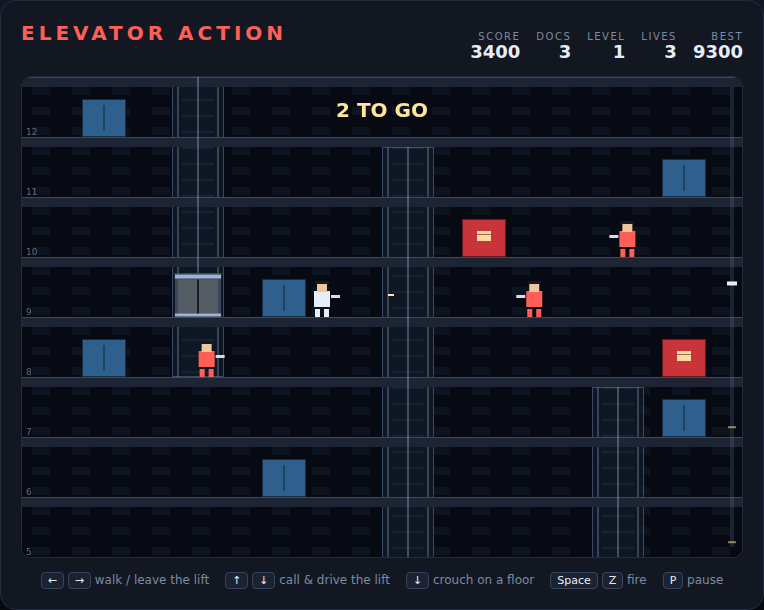

# Elevator Action

A top-to-bottom infiltration of a sixteen storey building, in the spirit of
Taito's *Elevator Action*. Take the secret documents from behind every red door,
ride the lifts down to the basement, and walk out of the getaway exit before the
building's agents gun you down.

Open `index.html` in any browser — no build step, no server.



## How to play

You drop onto the roof. Somewhere below you, behind the **red doors**, are the
documents you came for — walk into one and it opens. The **blue doors** are
where the agents come from.

There are no stairs. The only way down is the three lifts, and none of them runs
the whole height of the building, so every trip to the basement means
transferring:

| Shaft | Floors it serves |
|---|---|
| left | roof to 7 |
| middle | 4 to 11 |
| right | 8 to basement |

Stand inside a shaft and hold `↑` or `↓`: the car comes to you, stops level with
you, and the same key then drives it. Press `←` or `→` to step out — but only
when the deck is level with a floor. A car parked between floors is a dead end,
and also the safest spot in the building, because every bullet in the game flies
at standing height.

Which is the other half of the game. An agent's shot goes clean over a crouching
spy, so `↓` on a floor is a dodge; it just roots you to the spot while you hold
it. Your own shot from a crouch stays low and still hits a standing agent, so
crouching costs you nothing but mobility.

The lifts are a weapon too. Drive a car into an agent standing in the shaft and
it is flattened, for three times what a bullet is worth.

The basement exit stays shut until the last document is in your pocket. Take all
of them, get to the bottom, head left, and you are out.

## Controls

| Input | Action |
|---|---|
| `←` `→` or `A` `D` | walk; step off a car that is level with a floor |
| `↑` `↓` or `W` `S` | call and drive the lift in the shaft you are standing in |
| `↓` or `S` | crouch, on a floor away from a lift you could call |
| `Space`, `Z` or `X` | fire |
| `Space` / `Enter` | start, or restart after game over |
| `P` | pause |

## Scoring

| Event | Points |
|---|---|
| Secret document | 500 |
| Agent shot | 100 |
| Agent crushed by a lift | 300 |
| Escaping the building | 1000 |

Three buildings, each with more documents and faster agents than the last.
Clear the third and you have won. Your best score is kept in the browser.

## How the code works

See [DESIGN.md](DESIGN.md) for the world model, the mechanics and the
assumptions behind them.

## Tests

```powershell
npx playwright test ElevatorAction/tests/
```

110 Playwright specs cover the building layout, walking and crouching, calling
and driving the lifts, documents and the exit, shooting, the agents and their
AI, getting hit, crushing, scoring and rendering. The whole simulation runs
through `step(dt)` with the animation loop switched off, so every spec is
deterministic.
