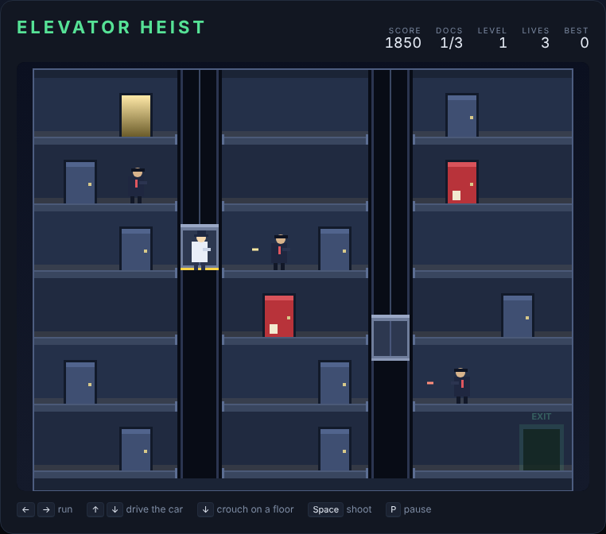

# Elevator Heist

A six-storey office block, three secret documents behind the red doors, and a
getaway exit on the ground floor. Grab everything and get out — the building's
two elevators never stop moving, and neither do the agents.



## How to play

1. Press **Space** (or click **Start Game**) to begin on the top floor.
2. Run along a corridor and stand in front of a **red door** to open it and
   take the document inside. Blue doors hold nothing but trouble.
3. Shaft gaps are holes in the floor. You can only cross one — or go up and
   down — while an elevator car is level with your floor. Walk into the gap and
   you are aboard.
4. A car you are standing on stops and obeys you: hold **↑** or **↓** to drive
   it. Step off and it goes back to patrolling on its own.
5. With all three documents banked, get to the **EXIT** on the ground floor,
   far right, to clear the level.

Enemy agents come out of the doors, walk you down, and shoot. They cannot
cross a shaft, so a gap between you and an agent is a wall for them — and a
car arriving is as much an ambush as an escape.

## Controls

| Input | Action |
|---|---|
| `←` `→` / `A` `D` | Run left / right |
| `↑` `↓` / `W` `S` | Drive the car you are riding |
| `↓` / `S` (on a floor) | Crouch |
| `Space` / `J` | Shoot |
| `P` | Pause |
| `Space` / `Enter` | Start, or resume from pause |

## Crouching

Everybody fires at chest height, so a standing shot sails straight over a
crouching target. Crouching is your dodge — and because a crouched shot is
fired low, it still hits a standing agent. You cannot run while crouched.

## Scoring

| Event | Points |
|---|---|
| Document | 500 |
| Agent | 150 |
| Level cleared | 2000 |

Three lives. Dying costs one and puts you back on the top floor with the
documents you have already banked; the agents and the gunfire clear out. Each
level loads a new door layout and sends agents at you faster. The best score is
kept in `localStorage`.

## Running the tests

From the repository root:

```powershell
npx playwright test ElevatorHeist/tests/
```

## Design

See [DESIGN.md](DESIGN.md) for how the code works — the building geometry, the
shaft predicates, the elevator rules, and the assumptions behind them.
