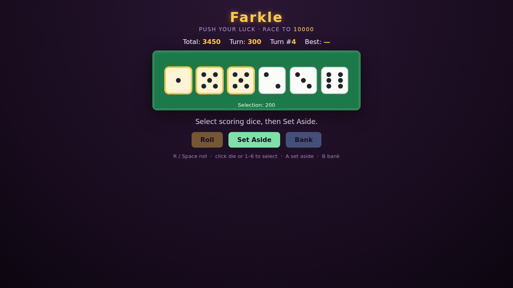

# Farkle

The classic **push-your-luck dice game**, on an HTML5 canvas. Roll six dice,
set aside the ones that score, and decide: bank your points, or reroll the rest
for more? Roll no scoring dice and you **Farkle**, losing everything you'd built
up that turn. Race to **10,000 points** in as few turns as you can.



## How to play

1. Press **Start**, then **Roll** to throw your dice.
2. If nothing scores, that's a **Farkle** — your turn ends with no points.
3. Otherwise, click the scoring dice you want to keep and press **Set Aside**.
   Every die you select must score, or the selection is refused. Their value is
   added to your **turn score**.
4. Now either **Roll** the remaining dice again (risking your turn score) or
   **Bank** to lock the turn score into your total.
5. Set aside all six dice and you get **hot dice** — roll all six again and keep
   going.
6. First to 10,000 wins. Your best (fewest) turn count is saved.

## Scoring

| Combination | Score |
|---|---|
| Single 1 | 100 |
| Single 5 | 50 |
| Three 1s | 1000 |
| Three of a kind (face `n`, n≠1) | `n × 100` |
| Four of a kind | 1000 |
| Five of a kind | 2000 |
| Six of a kind | 3000 |
| Straight 1-2-3-4-5-6 | 1500 |
| Three pairs | 1500 |

Dice showing 2, 3, 4, or 6 score nothing on their own — only in a
three-of-a-kind or better. The straight and three-pairs bonuses need all six
dice.

## Controls

| Input | Action |
|---|---|
| **Roll** / `R` / `Space` | Roll the available dice |
| Click a die / `1`–`6` | Toggle its selection (while choosing) |
| **Set Aside** / `A` | Bank the selected scoring dice into the turn score |
| **Bank** / `B` | Add the turn score to your total and end the turn |

## Files

- `index.html` — page markup, HUD, and overlay.
- `style.css` — felt-table styling.
- `game.js` — all game logic and canvas rendering (module scope, so tests drive
  it deterministically).
- `DESIGN.md` — design notes, scoring rationale, and assumptions.
- `tests/farkle.spec.js` — Playwright test suite.

## Running the tests

From the repository root:

```bash
npx playwright test Farkle/tests/
```
