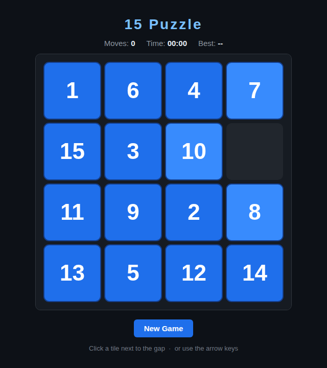

# 15 Puzzle

The classic sliding-tile puzzle, built with HTML5 Canvas. Slide the numbered
tiles around the single empty space until they read 1–15 in order.

## How to Play

Open `index.html` in any modern browser — no build step, no dependencies.

| Input | Action |
|---|---|
| **Click** a tile next to the gap | Slide it into the gap |
| **Arrow keys** | Slide the tile on that side of the gap in the arrow's direction |
| **New Game** | Reshuffle into a fresh, solvable scramble |

**Objective:** Arrange the tiles `1` through `15` in order with the empty space
in the bottom-right corner, using as few moves as possible.

Every scramble is generated by making random *legal* moves from the solved
state, so it is always solvable — no dead ends. Tiles that can currently move
are drawn slightly brighter as a hint.

Your fewest-moves record is saved in `localStorage` and shown as **Best**.

## Design

See [DESIGN.md](DESIGN.md) for how the code works — the board model, move and
win logic, the solvable-by-construction shuffle, and rendering.
