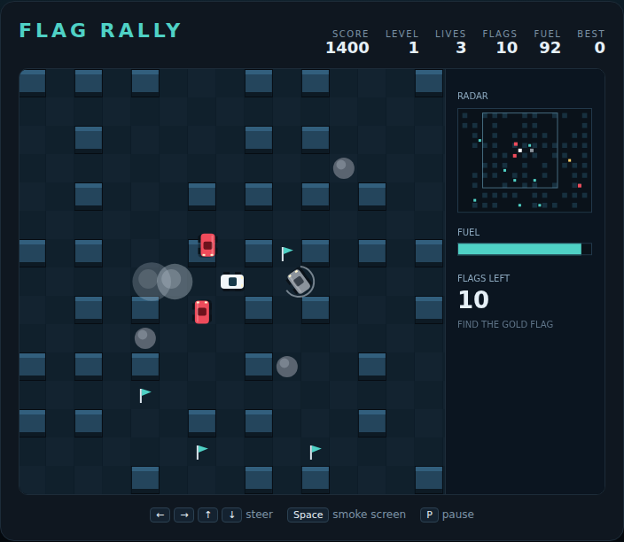

# Flag Rally

A top-down rally game in a scrolling pillar maze. Collect all ten checkpoint
flags while four rival cars hunt you, dropping smoke screens to spin them out —
and keep an eye on the fuel.

Open `index.html` in a browser. No build step, no server, no assets to fetch.



## How to play

| Input | Action |
|---|---|
| `←` `→` `↑` `↓` or `A` `D` `W` `S` | steer |
| `Space` | drop a smoke screen (also starts / restarts the game) |
| `P` | pause / resume |

The course is bigger than the window, so the view scrolls with your car. The
**radar** on the right shows the whole course: every flag still out there, every
rival, and where you are — use it to plan a route to flags you cannot see.

### Rules

- **Collect all ten flags** to clear the level. Each is worth 100 points.
- **The gold "S" flag** is the special flag. Once you have it, every flag you
  collect afterwards on that level is worth 200.
- **Rival cars** steer towards you constantly. Touching one wrecks your car and
  costs a life. So does hitting a boulder — though boulders are never laid in a
  way that seals a flag off, so every flag can always be reached cleanly.
- **Smoke screen** (`Space`) drops a puff of exhaust behind you for 6 fuel. A
  rival that drives into it spins out for three seconds — 200 points — and is
  harmless and stationary while it spins, so you can drive straight through it.
- **Fuel** drains as you drive. Running dry does not kill you: the car slows to
  a crawl and the smoke screen stops working, which usually means the rivals
  catch you soon after.
- **Clearing a level** pays `level × 200` plus 5 points for every unit of fuel
  left in the tank, so a fast clean run scores far better than a slow one. The
  next level brings one more rival and two more boulders, on a brand new course.
- You get three lives. A wreck only resets the cars — flags you already
  collected stay collected.

Your best score is kept in the browser's local storage.

## How it works

`game.js` is a single classic script. The course is a seeded pillar maze: walls
only ever stand on cells whose row and column are both odd, which guarantees the
whole course stays connected, so no flag is ever unreachable and no rival can be
boxed in.

All motion is expressed per second and applied through `step(dt)`;
`requestAnimationFrame` only supplies the timestep and calls `draw()`. That
keeps the simulation deterministic and lets the Playwright specs advance the
game frame by frame.

See [DESIGN.md](DESIGN.md) for the full design — geometry, mechanics, scoring,
the chase AI, and the assumptions made along the way.

## Tests

From the repository root:

```powershell
npx playwright test FlagRally/tests/
```
