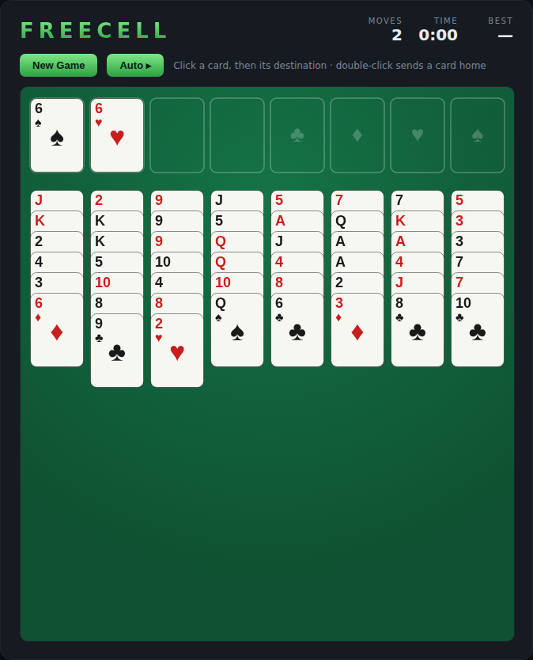

# FreeCell

The classic open-information solitaire, on an HTML5 canvas. Every card is dealt
face-up; with four free cells for temporary storage, build all four suits up
from Ace to King. Almost every deal is winnable — it's a game of planning, not
luck.



## How to play

All 52 cards are dealt into eight columns. Move cards between columns in
**descending, alternating-colour** runs (a red 6 goes on a black 7), park single
cards in the four **free cells**, and send each suit up to its **foundation** in
order (A, 2, 3, … K). Clear all four foundations to win.

Valid runs move together in a single "supermove" — the number of cards you can
move at once grows with the free cells and empty columns available.

### Controls

- **Click** a card, free cell, or foundation to pick it up (a valid run picks up
  together), then **click** where it should go.
- **Double-click** a card to send it straight home to its foundation.
- **Auto ▸** (or press `A`) sweeps every card that can safely go home.
- **New Game** deals a fresh board. Press any key to start.

## Scoring

FreeCell is won or lost — there's no points score. The HUD tracks your **Moves**
and elapsed **Time**, and **Best** remembers the fewest moves you've ever won in
(saved in the browser via `localStorage`).

## Running

Open `index.html` directly in a browser — no build step or server required.

## Development

Tests are written with [Playwright](https://playwright.dev) and live in
`tests/`. From the repo root:

```powershell
npm install
npx playwright install chromium
npx playwright test FreeCell/tests/
```

See [DESIGN.md](DESIGN.md) for how the code is structured.
