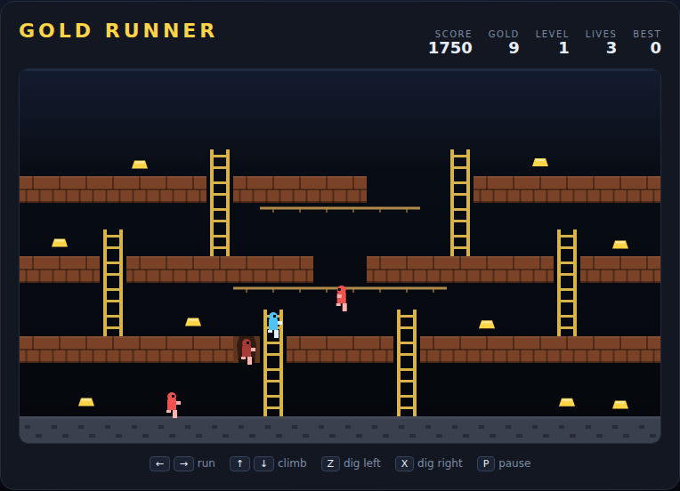

# Gold Runner

A single-screen vault raid in the spirit of *Lode Runner*. Sweep up every bar of
gold, then climb the escape ladders that appear at the top of the vault.

Open `index.html` in any browser — no build step, no server.



## How to play

You cannot jump and you cannot fight. You run, you climb ladders, you swing
along ropes — and you drill. `Z` and `X` bore a hole through the brick
diagonally below you, opening a route down to the next floor and, more
importantly, a trap.

A guard that walks into a hole is stuck for a few seconds. If the brick knits
itself back together while the guard is still inside, the guard is crushed and
respawns at the top of the vault. Trapped guards are harmless, so a hole full of
guard is also a safe patch of floor to run over.

The same brick will crush you. Dig yourself into a pit you cannot walk out of
and you lose a life — and a life costs you the whole level, gold included.

Collect the last bar and the escape ladders light up at the top of the screen.
Reach the top row and the level is yours.

## Controls

| Input | Action |
|---|---|
| `←` `→` or `A` `D` | run, or move along a rope |
| `↑` `↓` or `W` `S` | climb a ladder; `↓` lets go of a rope |
| `Z` or `,` | dig down-left |
| `X` or `.` | dig down-right |
| `Space` / `Enter` | start, or restart after game over |
| `P` | pause |

## Scoring

| Event | Points |
|---|---|
| Gold bar | 250 |
| Guard crushed | 75 |
| Level cleared | 1500 |

Three levels ship with the game and repeat with faster guards. Guards never
quite match your running speed, so any level can be survived on foot. Your best
score is remembered in the browser.

## Tips

- Ropes catch you mid-fall. Dropping past one on purpose costs less time than
  walking around, but you have to hold `↓` to keep going through it.
- Guards path towards you, so you can lead them onto a hole you have already
  dug rather than digging under one that is already on top of you.
- A brick takes five seconds to knit back. Dig too early and the guard climbs
  straight back out.

## Development

See `DESIGN.md` for the movement model, the guard pathfinding and the tile
format for levels. The Playwright suite lives in `tests/` and was written before
the implementation:

```powershell
npx playwright test GoldRunner/tests/
```

It includes three end-to-end specs that actually play each shipped level to
completion with the real physics, so a layout can never regress into being
unwinnable.
