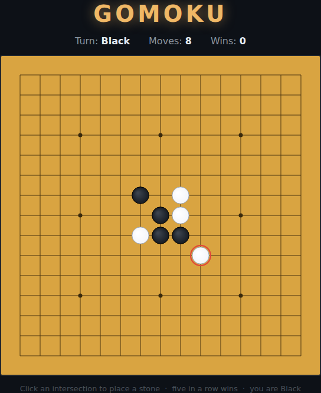

# Gomoku (Five in a Row)

A canvas version of the classic Go-board strategy game. You play **Black**
against a computer opponent (**White**) on a 15 × 15 board. Alternate placing
stones; the first to line up **five in a row** — horizontally, vertically, or
diagonally — wins.



## How to play

- **Click** any empty intersection to place your Black stone. The AI replies
  automatically after a short pause.
- Line up **five of your stones in an unbroken row** (any direction) to win.
- Fill the board with no such line and it's a **draw**.
- Press **Enter / Space**, or the **Start / Play Again** button, to begin or
  restart.

The last move is marked with a red ring, and the number of games you've won is
saved in the browser via `localStorage`.

## The AI

White uses a deterministic heuristic: it takes an immediate five if one is
available, blocks your five if you threaten one, and otherwise plays the move
that best extends its own open runs while denying yours, biased toward the
centre. It looks one move ahead — a solid club opponent, not a deep search.

## Running

Open `index.html` directly in any browser — no build step or server needed.

## Tests

Playwright tests live in `tests/gomoku.spec.js`. From the repo root:

```powershell
npx playwright test Gomoku/tests/
```

## Design

See [DESIGN.md](DESIGN.md) for the concept, mechanics, controls, the state the
game exposes for testing, and the assumptions made while scoping it.
