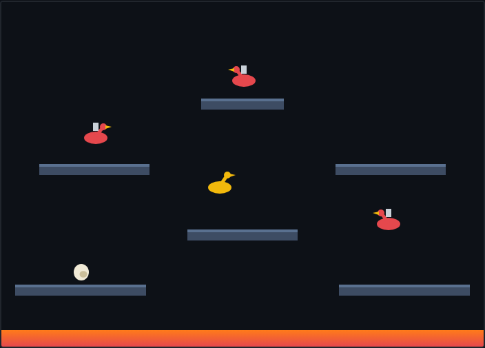

# Joust

Ride your flying mount over a lava-floored arena, joust the enemy riders by
crashing into them **from above**, and grab the eggs they drop before they hatch
into fresh foes. Clear every enemy to advance to the next wave.



## How to play

- **Flap** to fly: tap the flap key to beat your wings and rise; stop and gravity
  sinks you. It takes a light touch to hover.
- **Steer** left and right; the arena wraps around both edges.
- **Joust:** when you hit an enemy, whoever is **higher** wins. Land above them to
  defeat them; get caught below and you lose a life. A dead-level clash just bounces
  you both apart.
- **Eggs:** a defeated enemy drops an egg. Swoop in to collect it for bonus points —
  leave it too long and it hatches into a new enemy. Eggs that fall in the lava are
  gone.
- **Stay off the lava** at the bottom — touching it costs a life.

Clear all enemies (and their eggs) to move to the next, tougher wave. You have
three lives.

## Controls

| Action | Keys |
|---|---|
| Flap (fly up) | **Space**, **↑**, or **W** |
| Move left / right | **←** / **→** or **A** / **D** |
| Start | **Space**, an arrow key, or the **Start** button |
| Pause / resume | **P** |

## Running the tests

From the repository root:

```powershell
npx playwright test Joust/tests/
```

See [DESIGN.md](DESIGN.md) for how the code is structured.
