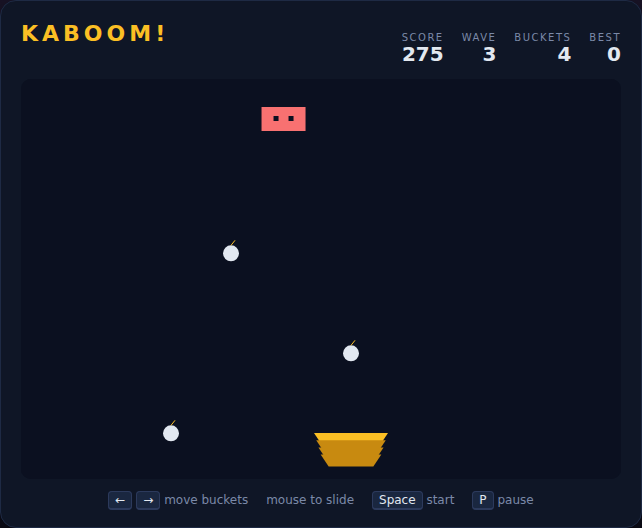

# Kaboom!

A bomb-catching reflex arcade game, built with plain HTML5 canvas and
JavaScript — no build step, no dependencies. A **Mad Bomber** paces across the
top of the screen dropping bombs; you slide a stack of buckets along the bottom
to catch every one before it hits the ground. Miss a bomb and it explodes,
taking a bucket with it. Lose all your buckets and it's game over.

Inspired by the 1981 Activision classic.



## How to play

Open `index.html` in any modern browser. Press **Space** (or click **Start
Game**) to begin.

| Key | Action |
|---|---|
| ← / A | Move the bucket stack left |
| → / D | Move the bucket stack right |
| Mouse move | Slide the bucket stack to the pointer |
| Space | Start / restart the game |
| P | Pause / resume |

- Catch a bomb by lining the bucket stack up underneath it before it drops past
  the catch line. Each bomb is worth **`wave`** points, so later waves pay more.
- Catch **10 bombs** to clear a wave. Clearing a wave earns a **bonus bucket**
  (up to 5) and speeds the bomber up while it drops bombs more often.
- Missing a single bomb destroys a bucket **and** detonates every other bomb on
  screen, resetting your progress toward the current wave.
- You start with 3 buckets; when the last one is gone the game ends.
- Your best score is saved in the browser's `localStorage`.

## Development

Kaboom! follows the repo-wide test setup. From the repository root:

```powershell
npm install
npx playwright install chromium
npx playwright test Kaboom/tests/
```

See [DESIGN.md](DESIGN.md) for how the code is structured and how the simulation
is made deterministic for testing.
