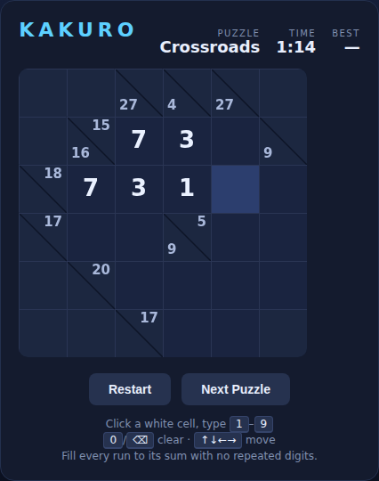

# Kakuro

**Kakuro** (also known as *Cross Sums*) is a number-crossword logic puzzle.
Fill every white cell with a digit **1–9** so that each horizontal and vertical
run of cells adds up to the clue printed in the black cell at its start — using
**no repeated digit** within a run.



## How to play

- A black clue cell shows the target sum for the run to its **right** (the number
  above the diagonal) and/or the run **below** it (the number below the diagonal).
- Click a white cell to select it, then type a digit **1–9**.
- A run turns **green** when it is completely and correctly filled, and **red**
  the moment it is full but wrong, or as soon as it contains a repeated digit —
  so mistakes show up immediately.
- Solve every run and the puzzle is complete; your time is recorded and the best
  (fastest) time for each puzzle is kept.

The bundle ships three puzzles of increasing size — *Warm-up* (5×5),
*Crossroads* (6×6), and *Lattice* (7×7) — each with a single, unique solution.

## Controls

| Input | Action |
|---|---|
| Click a white cell | Select it |
| <kbd>1</kbd>–<kbd>9</kbd> | Enter a digit |
| <kbd>0</kbd> / <kbd>Backspace</kbd> / <kbd>Delete</kbd> | Clear the cell |
| <kbd>↑</kbd> <kbd>↓</kbd> <kbd>←</kbd> <kbd>→</kbd> | Move the selection |
| <kbd>N</kbd> / Next Puzzle | Load the next puzzle |
| Restart | Clear the current puzzle |

## Running

Open `index.html` directly in any modern browser — no build step or server
required.

## Tests

Playwright tests live in `tests/`. From the repo root:

```powershell
npx playwright test Kakuro/tests/
```

The puzzle logic is exposed as plain globals and the timer is advanced through a
dedicated `tick(dt)` function, so the tests exercise selection, entry, run
validation, solving, and best-time persistence deterministically — including an
integrity check that every bundled puzzle's solution is valid, repeat-free, and
actually solves the board.

See [DESIGN.md](DESIGN.md) for the full design, mechanics, and assumptions.
