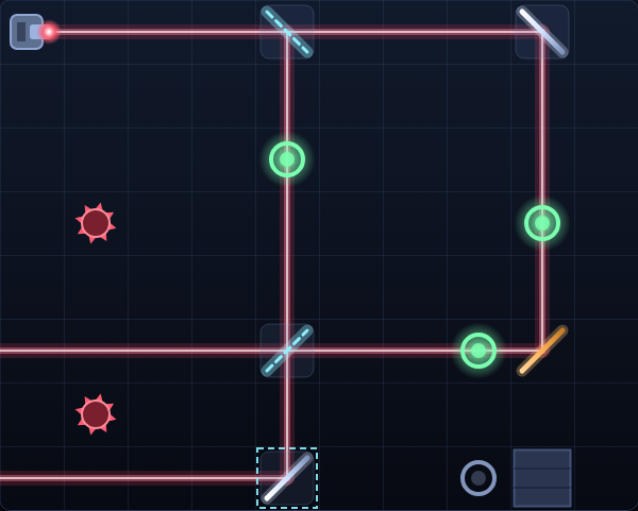

# Laser Maze

Turn the mirrors so one laser lights every target ring — and keep it off the mines.



## How to play

The emitter on the board fires a single beam. Diagonal mirrors bend it 90°,
splitters cut it into two beams, walls stop it and mines swallow it. Each level
starts with the mirrors pointing the wrong way; flip them until the beam runs
through **every** ring at once.

- **Click** a mirror or splitter to flip it between `/` and `\`.
- **Arrow keys** move the keyboard cursor, **Space** flips the device under it.
- **R** resets the level, **N** moves on once you have solved it.
- The level strip under the board jumps to any level you have unlocked.

Devices sitting on a faint socket can be turned. Bare ones — the amber mirrors —
are fixed scenery, and so are walls, rings and mines.

## Scoring

Every flip is a move. Each level shows a **par**: the fewest flips that can
possibly solve it. Matching par is the goal; your best run per level is kept in
the browser, along with how far through the eight levels you have reached.

## Levels

| # | Name | Par | What it introduces |
|---|---|---|---|
| 1 | First Light | 1 | One mirror, one ring |
| 2 | Double Back | 2 | Two bounces to reach around |
| 3 | Crossfire | 2 | Mines, and rings strung along one beam |
| 4 | Split Decision | 2 | Beam splitters |
| 5 | Switchback | 3 | A three-bounce circuit |
| 6 | Triple Threat | 2 | Two splitters, three rings |
| 7 | Labyrinth | 3 | Fixed mirrors and walls |
| 8 | Grand Prism | 3 | Everything at once, four rings |

## Running it

Open `index.html` in any browser — no build step, no server.

## Tests

From the repository root:

```powershell
npx playwright test LaserMaze/tests/
```

The suite covers the beam tracer rule by rule (reflection, splitting, walls,
mines, loop termination), the input and HUD, and the levels themselves: for each
level it brute-forces every mirror combination to prove the level is solvable
and that its published par really is the minimum.
