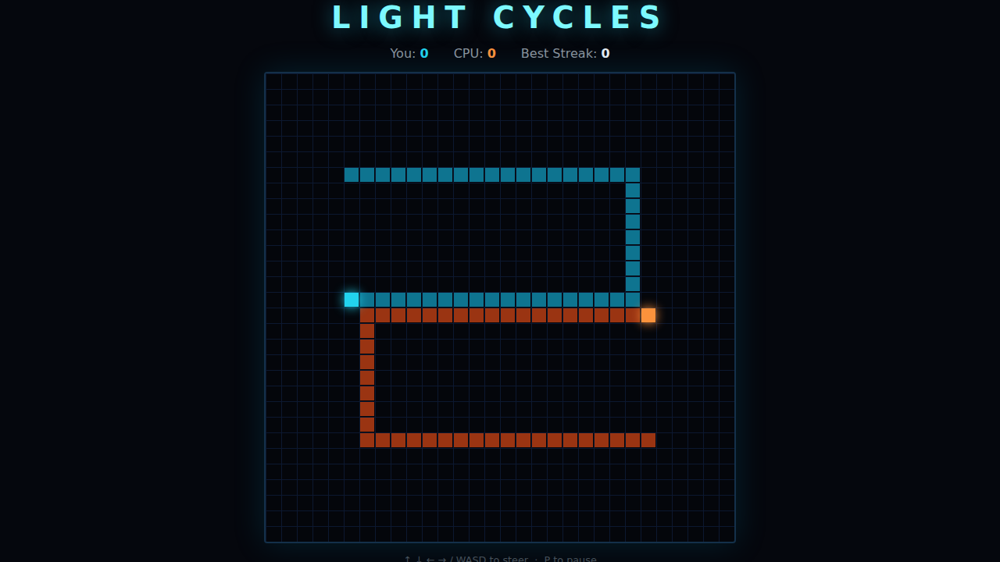

# Light Cycles

A Tron-inspired grid duel. Pilot your cyan light cycle, leave a wall of light
behind you, and force the orange CPU cycle to crash before you do. First to
**5** round wins takes the match.

## How to play

Open `index.html` in any modern browser — no build step or server needed.

- Your cycle moves on its own and can never stop — you can only **steer**.
- Every cell you pass through becomes a solid trail.
- You crash if you hit a **wall**, your **own trail**, or the **enemy trail**.
- Make the CPU crash first to win the round.

## Controls

| Key | Action |
|---|---|
| ↑ ↓ ← → or W A S D | Steer up / down / left / right |
| P | Pause / resume |
| Space | Start / play again |

You cannot reverse straight back into yourself — the opposite-direction input
is ignored.

## Scoring

- **You** and **CPU** in the HUD count round wins for the current match.
- **Best Streak** tracks your longest run of consecutive round wins ever, and
  is saved in your browser (`localStorage`).

## Under the hood

See [DESIGN.md](DESIGN.md) for the game concept, mechanics, the deterministic
CPU AI, the state machine, and the TDD approach. Tests live in `tests/` and run
with Playwright (`npx playwright test LightCycles/tests/`).
