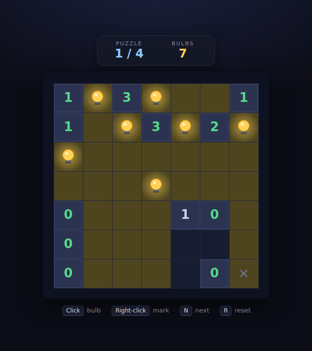

# Light Up (Akari)

A canvas implementation of **Akari** (also called **Light Up**), the binary-
determination logic puzzle from Nikoli. Place light bulbs on a grid so that
**every white cell is illuminated** — while making sure no bulb shines on another
and every numbered wall is touched by exactly the right number of bulbs.

It's a pure deduction puzzle (no timer, no luck) and — despite the similar name —
has nothing to do with *Lights Out*.



## How to play

Open `index.html` in any browser — no build step or server required.

1. The board is a **7×7 grid** of white cells and black **walls**. Some walls
   carry a number from **0 to 4**.
2. **Left-click** a white cell to drop a **bulb**. A bulb lights its own cell and
   shines along its row and column until a wall or the board edge blocks it.
3. Solve the puzzle by satisfying all three rules at once:
   - **every white cell is lit**,
   - **no bulb shines on another bulb** (a bulb that does is ringed in red),
   - **each numbered wall has exactly that many bulbs** orthogonally adjacent —
     the number turns **green** when it's exactly right, **red** when there are
     too many.
4. **Right-click** a cell to leave a small **dot mark** — a note to yourself that
   a cell *can't* hold a bulb. Marks are just an aid and never affect the answer.
5. Solve a puzzle and the board lights up; take the next of the **four** shipped
   puzzles.

## Controls

| Input | Action |
|---|---|
| **Left-click / tap** | Place or remove a bulb |
| **Right-click** | Place or remove a "no bulb" mark |
| **Enter / Space / Click** | Start (from the title screen) |
| **N** | Next puzzle (after solving) |
| **R** | Reset the current puzzle |

## Design

See [DESIGN.md](DESIGN.md) for the rules, architecture, and assumptions. In
short: every rule is a pure function over integer grids with no dependency on
animation or the clock, so the Playwright suite builds exact positions and
asserts the outcome directly. All four puzzles were generated offline and each
verified to have a **unique** solution.

## Tests

```bash
npx playwright test LightUp/tests/
```
