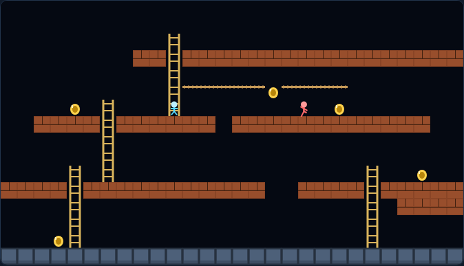

# Lode Runner

Collect the gold, outwit the guards, dig your way out of trouble.



Open `index.html` in a browser — no build step or server required.

## How to play

You are the blue runner. Every level is scattered with gold; take all of it and
a hidden escape ladder appears at the top of the screen. Climb it and you are
through to the next level.

The red guards chase you the whole time and one touch is fatal. You cannot jump
and you cannot fight — but you can drill a hole in the brick beside you. A
guard that walks into the hole is stuck in it, and a few seconds later the
brick grows back and buries it. Stand in a hole yourself when it closes and you
lose a life.

## Controls

| Key | Action |
|---|---|
| ← → / A D | run |
| ↑ ↓ / W S | climb ladders, drop off ropes |
| Z or , | dig down-left |
| X or . | dig down-right |
| P | pause / resume |
| Space / Enter | start, or restart after game over |

## Scoring

| | Points |
|---|---|
| Gold | 100 |
| Burying a guard | 75 |
| Clearing a level | 250 |

You start with three lives. The best score is kept in the browser between
visits.

## Tips

- Only brick can be dug; the grey stone will not budge, and neither will a
  ladder or a floor with something sitting on it.
- Your own hole is a shortcut downwards — you drop straight through, while a
  guard falling in gets stuck.
- A hole flashes just before it closes. That is your cue to be somewhere else.
- Guards are slower than you but they never stop, so keep moving and use the
  ropes: they cross open space where the floors do not.

## Tests

Playwright specs live in `tests/` and cover the movement rules, digging, the
guards, the escape and the level maps — including an autopilot that plays every
level from start to escape.

```powershell
npx playwright test LodeRunner/tests/
```
