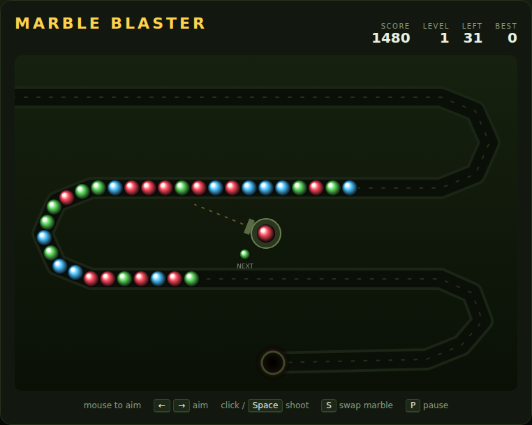

# Marble Blaster

A marble-shooting chain puzzler, built with plain HTML5 canvas and JavaScript —
no build step, no dependencies. A chain of coloured marbles snakes along a
winding track toward the pit at the end. You sit in the middle with a launcher:
fire marbles into the chain, line up **three or more of the same colour**, and
pop them before the chain runs out of track.



## How to play

Open `index.html` in any modern browser. Press **Space** (or click **Start
Game**) to begin.

| Input | Action |
|---|---|
| Mouse move | Aim the launcher |
| Click / Space | Fire the loaded marble |
| ← / → | Swing the aim |
| S | Swap the loaded marble with the next one |
| P | Pause / resume |
| Space | Start / restart the game |

- A shot wedges into the chain wherever it lands. Three or more of a colour in a
  row pop and score **10 points per marble**.
- If popping a run leaves two matching colours facing each other, they pop too —
  a **chain reaction**. Each stage of a reaction raises the multiplier, so a
  double is worth far more than two separate matches.
- The launcher only ever loads a colour that is still on the track, and **S**
  swaps to the next one, so there is always a useful shot available.
- While marbles are still streaming out of the entrance the chain moves fast;
  once the last one is out it slows to a crawl. Clearing the whole chain
  finishes the level and banks a bonus of **250 × level**.
- Every level sends more marbles, moves faster, and adds a colour every other
  level (up to six).
- The border and the pit flash red once the lead marble is close to falling in.
  When it reaches the pit, the run is over.
- Your best score is saved in the browser's `localStorage`.

## Development

Marble Blaster follows the repo-wide test setup. From the repository root:

```powershell
npm install
npx playwright install chromium
npx playwright test MarbleBlaster/tests/
```

See [DESIGN.md](DESIGN.md) for how the code is structured and how the simulation
is made deterministic for testing.
