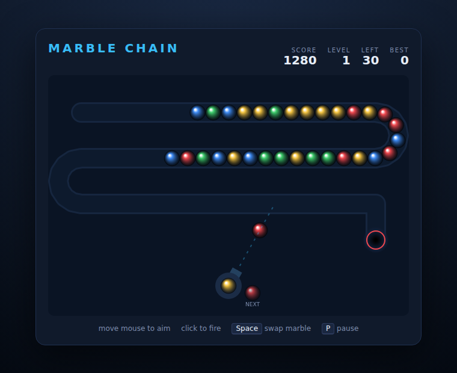

# Marble Chain

A marble shooter on an HTML5 canvas. A chain of coloured marbles crawls along a
winding track toward a pit — fire marbles into it and burst them before the
first one drops in.



## Playing

Open `index.html` in a browser. No build step or server required.

## How to play

- Move the mouse to aim the cannon, click to fire.
- Three or more marbles of the same colour touching each other burst.
- Bursting leaves a gap; the rear of the chain slides forward to close it. If
  that brings two same-coloured sections together they burst too — each extra
  burst in the cascade multiplies the points.
- A shot that joins the chain without matching shoves the front of the chain
  one marble closer to the pit, so a wasted shot costs you ground.
- Clear every marble in a level to move on. Later levels crawl faster, feed more
  marbles, and add colours (four at level 1, all six from level 7).
- The game ends when the front marble reaches the pit.

## Controls

| Input | Action |
|---|---|
| Mouse move | Aim |
| Left click | Fire |
| `Space` | Swap the loaded marble with the next one (starts the game when idle) |
| Right click | Swap the loaded marble with the next one |
| `P` | Pause / resume |

## Scoring

A burst scores `10 × marbles burst × cascade step`, so a run of five that sets
off a second burst is worth far more than two separate threes. The best score is
kept in `localStorage`.

## Tests

```powershell
npx playwright test MarbleChain/tests/
```

See [DESIGN.md](DESIGN.md) for how the code works.
