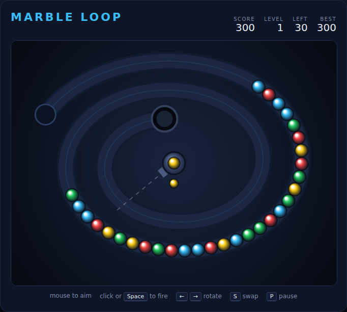

# Marble Loop

A spiral marble-shooter in the tradition of *Puzz Loop* and *Zuma*, built with
plain HTML5 canvas and JavaScript — no build step, no dependencies.

A chain of coloured marbles crawls along a spiral track toward the pit at its
centre. You sit in the middle behind a rotating launcher: fire marbles into the
chain, land three or more of a colour together and they burst. Clear the whole
track before the leading marble tips into the pit.



## How to play

Open `index.html` in any modern browser. Press **Space** (or click **Start
Game**) to begin.

| Input | Action |
|---|---|
| Mouse move | Aim the launcher at the pointer |
| Click | Fire |
| ← / → (or A / D) | Rotate the launcher |
| Space | Start / fire / continue to the next level |
| S | Swap the loaded marble with the queued one |
| P | Pause / resume |

- **Bursting.** Three or more touching marbles of the same colour burst the
  instant they line up — including the marble you just fired.
- **Combos.** A burst leaves a hole, and the marbles behind it rush forward to
  close it. If the two ends that meet match, they burst too. Every burst within
  1.4 s of the last one raises the multiplier, up to **×5** — chaining is where
  the points are.
- **Loaded colours** are drawn only from colours still on the track, so a shot is
  never wasted. Hold a colour back with **S** when the shot you want isn't the
  one you're holding.
- **Insertion is on your side.** A marble slotted into a packed chain pushes the
  marbles *behind* it backwards, buying you a little distance — except a shot
  landing ahead of the leader, which has nothing to push against.
- **Levels** get longer, faster and more colourful. Clearing one is worth
  `100 × level`.

There is one life: the run ends the moment the leading marble reaches the pit.
Your best score is kept in the browser's local storage.

## Scoring

| Event | Points |
|---|---|
| Burst of `n` marbles | `10 × n × combo` |
| Combo multiplier | ×1 up to ×5 |
| Level cleared | `100 × level` |

## Files

| File | Purpose |
|---|---|
| `index.html` | Canvas, HUD and overlay markup |
| `style.css` | Arcade shell, HUD and overlay styling |
| `game.js` | Track, chain, launcher, scoring and rendering |
| `DESIGN.md` | How the code works, and the assumptions behind it |
| `tests/marbleloop.spec.js` | Playwright test suite |

## Tests

From the repository root:

```powershell
npx playwright test MarbleLoop/tests/
```
