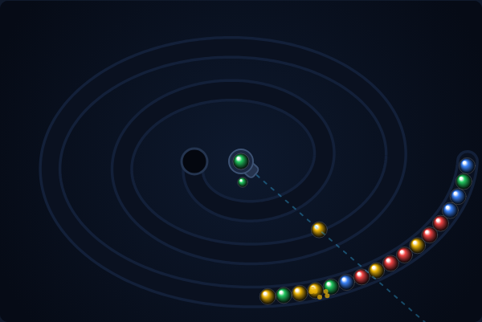

# Marble Shooter

A Zuma-style path shooter, built with plain HTML5 canvas and JavaScript — no
build step, no dependencies. A train of coloured marbles crawls along a spiral
track toward the hole at its centre. You sit in the middle with a cannon: fire
marbles into the train, line up **three or more of a colour**, and they pop.
Clear the whole train to move on. Let its head reach the hole and the run is
over.



## How to play

Open `index.html` in any modern browser. Press **Space** (or click **Start
Game**) to begin.

| Input | Action |
|---|---|
| Mouse move | Aim the cannon |
| Click | Fire at the pointer |
| ← / → (or A / D) | Rotate the cannon |
| Space | Start the game / fire while playing |
| S | Swap the loaded marble with the next one |
| P | Pause / resume |

- A shot slots into the train wherever it lands. Three or more matching marbles
  in a row pop and are worth **10 points each**.
- When a run pops, the rear of the train snaps forward to close the gap. If the
  two marbles that meet at the seam match, they pop too — each step of the
  cascade **doubles, then triples** the value of the marbles it clears, so
  setting up a chain reaction is worth far more than three plain pops.
- Careful: a marble inserted at the very front of the train pushes the whole
  train one slot closer to the hole.
- The cannon only ever loads colours that are still somewhere in the train, and
  **S** swaps the loaded marble for the one behind it when the colour is wrong.
- Clearing every marble finishes the level, pays a **250 × level** bonus and
  deals a longer, faster train with one more colour in it (up to six).
- Your best score is saved in the browser's `localStorage`.

## How it works

See [DESIGN.md](DESIGN.md) for the track model, the rigid-train chain
representation, the insert/pop rules and the assumptions behind them.

## Development

Marble Shooter follows the repo-wide test setup. From the repository root:

```powershell
npm install
npx playwright install chromium
npx playwright test MarbleShooter/tests/
```

The suite in `tests/marble-shooter.spec.js` drives the game through its exported
globals (`step`, `fire`, `setChain`, `resolveMatches`, …) rather than through
pixels, so it covers the track geometry, insertion rules, cascades, level
progression and scoring deterministically.
