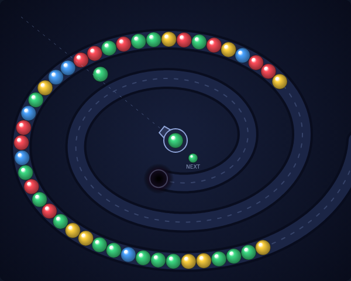

# Marble Spiral

A path-based marble shooter built with plain HTML5 canvas and JavaScript — no
build step, no dependencies. A train of coloured marbles winds its way along a
spiral towards the pit in the middle of the board. You sit in the eye of the
spiral, firing marbles into the train: line up three or more of a colour and
they pop. Clear every marble before the leading one drops into the pit.

Inspired by *Puzz Loop* and *Zuma*.



## How to play

Open `index.html` in any modern browser. Press **Space** (or click **Start
Game**) to begin.

| Input | Action |
|---|---|
| Mouse move | Aim the shooter |
| Click | Fire a marble |
| Space | Fire — or start / continue when the overlay is showing |
| S / right-click | Swap the loaded marble with the next one |
| P | Pause / resume |

- A fired marble slots into the train wherever it lands — in front of or behind
  the marble it touches. Inserting **never** pushes the train forwards, so it is
  always safe to shoot.
- Three or more marbles of one colour touching each other pop for
  `count × 10` points.
- A pop leaves a gap. When the tail catches up, if the colours across the gap
  match they pop as well — and each link in that chain doubles, triples, … the
  points. Setting up combos is how you score.
- The shooter only ever loads colours that are still on the track, so you never
  waste a shot on a dead colour.

## Levels

Clear every marble to finish the level and bank a `100 × level` bonus. Each
level adds more marbles, a faster train and — every other level — another
colour, up to six.

| Level | Marbles | Colours | Speed |
|---|---|---|---|
| 1 | 30 | 3 | 24 px/s |
| 3 | 42 | 4 | 34 px/s |
| 5 | 54 | 5 | 44 px/s |

Your best score is kept in the browser's `localStorage`.

## Development

Tests are Playwright specs living in `tests/`. From the repository root:

```powershell
npx playwright test MarbleSpiral/tests/
```

See [DESIGN.md](DESIGN.md) for how the track, the train and the combo system
work.
