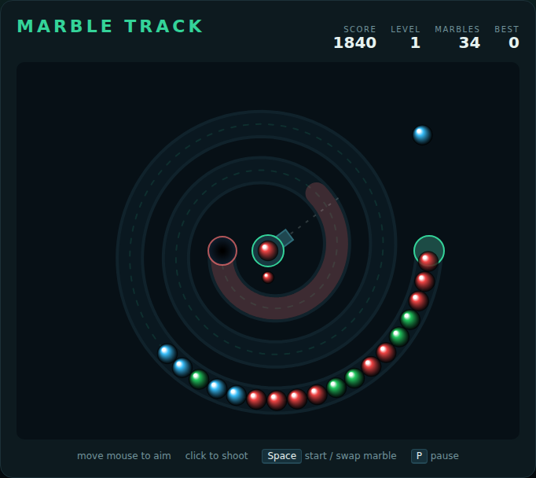

# Marble Track

A marble-shooter built with plain HTML5 canvas and JavaScript — no build step,
no dependencies. A chain of coloured marbles winds along a spiral track toward
the hole in the middle. You sit at the centre on a turret: fire marbles into the
chain, line up three or more of a colour to pop them, and clear the track before
the leading marble drops into the hole.

Inspired by *Puzz Loop* and *Zuma*.



## How to play

Open `index.html` in any modern browser. Press **Space** (or click **Start
Game**) to begin.

| Input | Action |
|---|---|
| Mouse move | Aim the shooter |
| Click | Fire the loaded marble |
| Space | Start / restart, or swap the loaded and next marbles |
| Right-click | Swap the loaded and next marbles |
| P | Pause / resume |

- Marbles roll onto the track from the entrance on the right and creep toward the
  hole at the centre. The last stretch of track before the hole is tinted red —
  once the chain reaches it you are nearly out of time.
- A fired marble wedges itself into the chain where it lands. **Three or more of
  a colour** in a row pop for **10 points each**.
- When a pop closes a gap, the marbles that meet across it can pop too. Each
  extra pop in the cascade multiplies its points — a two-stage combo is worth
  much more than the same marbles cleared one shot at a time.
- The shooter only ever loads a colour that is still on the track, so you can
  never be handed a dead marble. Marbles arrive in pairs at most: the third one
  is always yours to place.
- Clear every marble in the level to bank a **`100 × level`** bonus and move on.
  Each level rolls out a longer, faster chain, and an extra colour joins every
  other level.
- One marble in the hole ends the run. Your best score is saved in the browser's
  `localStorage`.

## Development

Marble Track follows the repo-wide test setup. From the repository root:

```powershell
npm install
npx playwright install chromium
npx playwright test MarbleTrack/tests/
```

See [DESIGN.md](DESIGN.md) for how the code is structured, how the chain is
modelled as a single distance along the track, and how the simulation is made
deterministic for testing.
