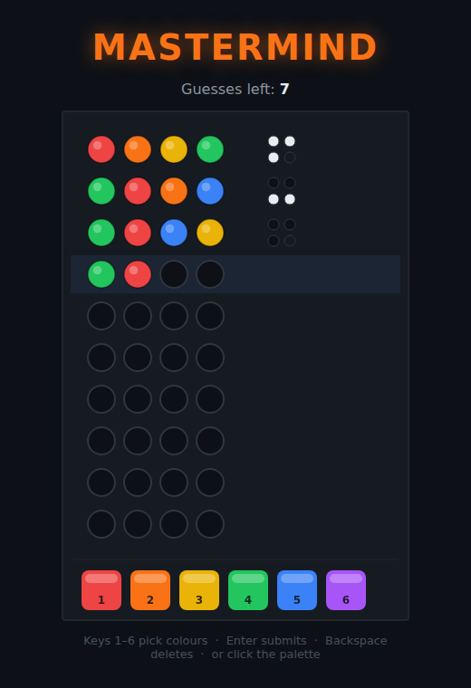

# Mastermind

The classic code-breaking game, built with HTML5 Canvas.

## How to Play

Open `index.html` in any modern browser — no build step, no dependencies.

A hidden code of **four coloured pegs** is drawn from **six colours** (colours
can repeat). You have **ten guesses** to crack it.

Build a guess with the number keys or by clicking the palette, then submit it.
Each guess is scored with small feedback pegs on the right:

- a **black** peg — right colour, **right** position;
- a **white** peg — right colour, **wrong** position.

The feedback doesn't say *which* peg was right — work that out yourself. Land
four black pegs to crack the code and win; run out of guesses and the answer is
revealed.

| Input | Action |
|---|---|
| Keys 1–6 | Pick a colour |
| Click a palette swatch | Pick a colour |
| Enter | Submit the current guess (must be full) |
| Backspace | Delete the last peg |
| Esc | Clear the current row |
| Any key | Start / play again |

See [DESIGN.md](DESIGN.md) for how the code is structured.
