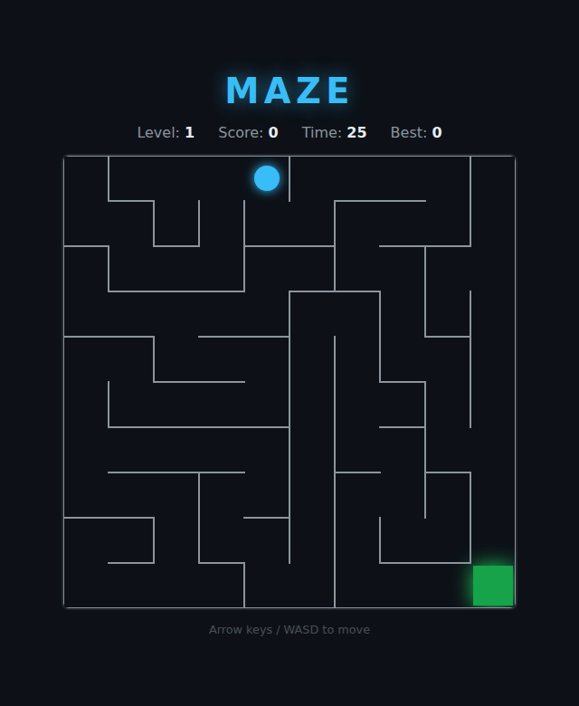

# Maze

A procedurally generated maze game built with HTML5 Canvas. Race from the
top-left entrance to the glowing bottom-right exit before the timer runs out —
each maze you solve builds a fresh, larger one for the next level.

## How to Play

Open `index.html` in any modern browser — no build step, no dependencies.

| Input | Action |
|---|---|
| Arrow keys or WASD | Move up / down / left / right |
| Start / Play Again button | Begin a new game |
| Any movement key (while idle / over) | Start a new game |

**Objective:** Find your way to the green glowing exit. Every maze is *perfect*
(exactly one route between any two points), so there is always a path — the
challenge is finding it before the clock hits zero.

**Levels & score:** Each maze you clear increases your score and generates a
new, slightly larger maze with a fresh time budget. Run out of time and the game
ends. Your best score is saved in `localStorage` and persists between sessions.

## How it works

See [DESIGN.md](DESIGN.md) for the maze-generation algorithm (iterative
recursive backtracker), the shortest-path solver, and the full list of state
exposed for testing.
