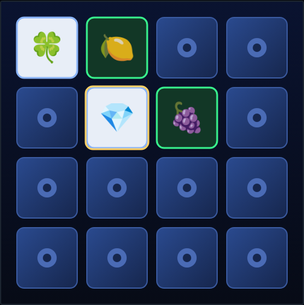

# Memory Match

A classic card‑matching memory game (a.k.a. *Concentration* / *Pairs*) on an
HTML5 canvas. Sixteen cards hide eight pairs of symbols — flip two at a time and
clear the whole board in as few moves as you can.



## How to play

1. Open `index.html` in a browser (no build step or server required).
2. Press **Space** / **Enter** or click **Start Game**.
3. Reveal a card, then reveal another:
   - **Match** → the pair stays face‑up.
   - **Mismatch** → both cards flip back down after a moment. Remember where they
     were!
4. Clear all **8 pairs** to win. Your best (fewest‑moves) run is saved.

## Controls

| Input | Action |
|---|---|
| Mouse click | flip the card under the pointer |
| ← ↑ → ↓ | move the selection cursor |
| Enter / Space | flip the selected card |
| Space / Enter | start / replay (from the overlay) |
| P | pause / resume |

## Scoring

- **Moves** — each completed two‑card attempt is one move.
- **Pairs** — how many of the 8 pairs you have found.
- **Time** — a running clock, shown on the win screen.
- **Best** — the fewest moves you have ever used to win, saved to `localStorage`
  (shown as `—` until your first win).

## Under the hood

See [DESIGN.md](DESIGN.md) for the concept, the rule model (`flipAt` /
`resolveMismatch`), rendering, and the assumptions made while building it. The
game is covered by a Playwright suite in [`tests/`](tests/); run it from the repo
root with:

```powershell
npx playwright test MemoryMatch/tests/
```
