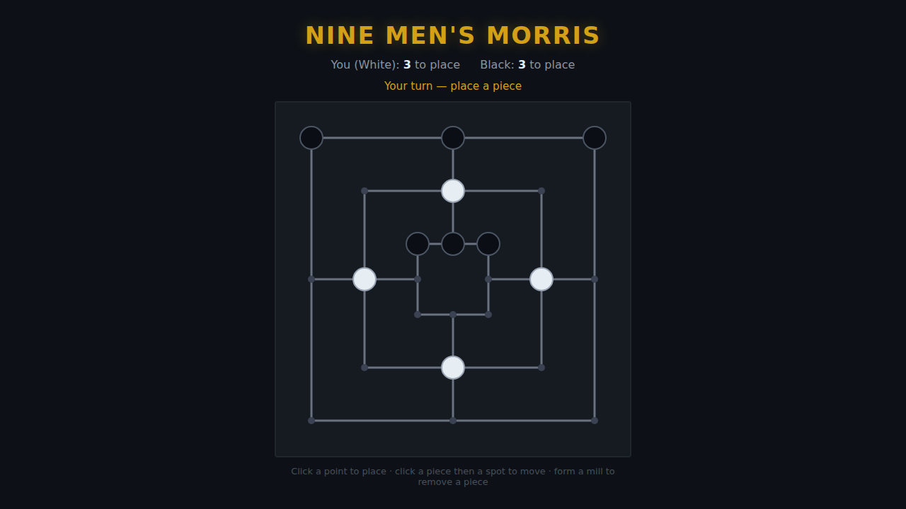

# Nine Men's Morris

A classic two-player strategy board game (also called **Mill**), on an HTML5
canvas. You play **White** against a deterministic computer **Black**. Line up
three of your pieces along a marked line — a **mill** — to capture one of your
opponent's pieces. Grind Black down to two pieces, or leave it with no legal
move, and you win.



## How to play

Open `index.html` directly in a browser — no build step or server needed.

### Controls

Nine Men's Morris is played entirely with the mouse:

| Action | Input |
|---|---|
| Place a piece / select one / choose a destination | **Click** a point |
| Remove an opponent piece (after forming a mill) | **Click** the piece |
| Start / restart | **Start** / **Play Again** button, or **Space** |

When it's your turn to move, click one of your pieces to select it — its legal
destinations light up — then click where you want it to go.

### Rules

- Each side has **nine pieces**. Play has three phases (tracked per player):
  1. **Placing** — put a piece on any empty point.
  2. **Moving** — once your hand is empty, slide a piece to an adjacent point.
  3. **Flying** — reduced to exactly three pieces, you may move to *any* empty
     point, not just an adjacent one.
- Form a **mill** (three of your pieces in a marked line) by placing or moving,
  and you remove one enemy piece. A piece in a mill can't be removed unless
  **every** enemy piece is in a mill.
- You **lose** if you're reduced to two pieces, or it's your turn to move and
  you have no legal move.
- **Black** plays a simple, fully deterministic heuristic: complete a mill if it
  can, otherwise block yours, otherwise strengthen its position.

## Files

| File | Purpose |
|---|---|
| `index.html` | Page markup, canvas, and HUD |
| `style.css` | Styling and the start / game-over overlay |
| `game.js` | Board model, rules, the computer opponent, rendering, and input |
| `DESIGN.md` | Design notes: concept, rules, board data, and assumptions |
| `tests/ninemensmorris.spec.js` | Playwright test suite |

## Development

From the repository root:

```powershell
npm install
npx playwright test NineMensMorris/tests/
```

See the root [README](../README.md) for full setup instructions.
