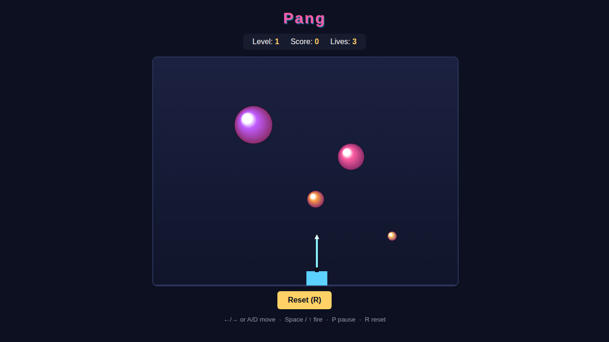

# Pang (Buster Bros)

A fixed-screen action game. Rubber balls bounce around the arena; you fire a
harpoon straight up to pop them. Every big ball you hit **splits into two
smaller balls**, so the screen gets busier before it clears. Pop everything to
finish the level — but don't let a ball touch you.



## How to play

Open `index.html` in any modern browser — no build step or server needed.
Press **Start Game** (or any movement/fire key) and start popping.

### Controls

| Key | Action |
|---|---|
| `←` / `→` or `A` / `D` | move left / right |
| `Space` / `↑` / `W` | fire the harpoon |
| `P` | pause / resume |
| `R` | reset to level 1 |

### Rules

- **Pop every ball.** A harpoon that hits a ball pops it for points.
- **Splitting.** A big ball splits into two of the next size down, flung apart;
  the smallest balls burst into nothing.
- **One harpoon at a time.** You can't fire again until the current harpoon
  pops a ball or reaches the top.
- **Don't get touched.** A ball touching you costs one of your 3 lives and
  re-lays the level; lose them all and it's game over.
- **Score.** +50 per ball popped, +200 for clearing a level. Clear a level to
  advance to a busier one.

## How it works

See [DESIGN.md](DESIGN.md) for the full design: the ball tiers and bounce
model, the harpoon/split logic, level layouts, and the deterministic
`step(dtMs)` simulation plus the `window` API the game exposes so its physics
can be tested without relying on the animation clock.

The code is split into:

- `index.html` — markup, HUD, canvas, and the start/game-over overlay.
- `style.css` — layout and the arcade colour scheme.
- `game.js` — game state, the fixed-timestep physics, rendering, and input.

## Tests

Playwright specs live in [`tests/pang.spec.js`](tests/pang.spec.js) and drive
the game through its `window` API (`step`, `fire`, `spawnBall`, `movePlayer`,
`getBalls`, `getState`, …). From the repo root:

```powershell
npx playwright test Pang/tests/
```
