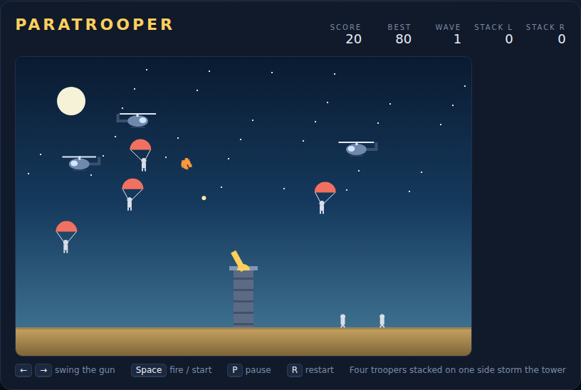

# Paratrooper

Defend a lone tower from an airborne invasion. Helicopters cross the night sky
from both edges and drop paratroopers; every man who reaches the sand walks to
your tower and joins the pile on his side. Let four stack up on the same side
and they scale the wall — the tower goes up and so does your run.

The gun cannot depress below the horizon, so a trooper who lands is a trooper
you keep. Clear the sky or lose the tower.



## Playing

Open `index.html` in any browser — no build step, no server.

## Controls

| Key | Action |
|---|---|
| `←` / `→` (or `A` / `D`) | Swing the gun |
| `Space` | Fire — also starts a game from the title screen |
| `P` | Pause / resume |
| `R` | Restart |

## Scoring

| Target | Points |
|---|---|
| Helicopter destroyed | 20 |
| Paratrooper shot in the air | 5 |

Shooting a helicopter before it empties takes its remaining troopers down with
it, so the earlier the kill the better the trade. Your best score is kept in
the browser's local storage.

## Tips

- Five shells may be in the air at once and there is a short cooldown between
  shots, so lead the helicopters rather than spraying.
- Troopers on opposite sides are counted separately — three on the left and
  three on the right is survivable, four on either side is not.
- The wave counter climbs every 20 seconds; each wave sends faster helicopters
  more often.

## Under the hood

See [DESIGN.md](DESIGN.md) for the mechanics, the code layout and the
assumptions behind them. The game is one plain script (`game.js`) whose state
and helpers are globals, which is what the Playwright suite in `tests/` drives
directly:

```powershell
npx playwright test Paratrooper/tests/
```
