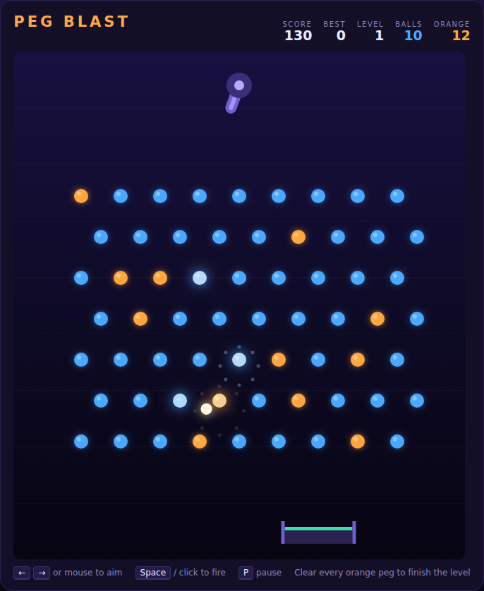

# Peg Blast

A Peggle-style aim-and-drop physics game. Swing the cannon at the top of the
board, fire a ball, and watch it ricochet down through the pegs. Clear every
**orange** peg to finish the level.



## How to play

1. Press **Space** (or click **Start Game**) to begin.
2. Aim with the **←** / **→** keys or by moving the mouse over the board.
3. Press **Space** or click to fire. You cannot steer a ball once it is away —
   the whole game is in the angle you choose.
4. Clear all 12 orange pegs before you run out of balls. Press **Space** on the
   *Level Clear* screen to move on.

| Input | Action |
|---|---|
| `←` / `→` (or `A` / `D`) | Swing the cannon |
| Mouse move | Aim at the pointer |
| `Space` | Start / fire / next level |
| Click the board | Fire |
| `P` | Pause / resume |

## Scoring

| Event | Points |
|---|---|
| Blue peg | 10 |
| Orange peg | 100 |
| Ball still in hand when the level clears | 500 each |

A multiplier rises as the level's orange pegs fall — **×2** at 4 cleared,
**×3** at 8, **×5** at 11 and **×10** as the last one goes — so a shot that
sweeps up a saved cluster of oranges is worth far more than the same pegs
picked off one at a time.

The bucket sliding along the bottom of the board returns any ball it catches,
so a drop that threads the gutter costs you nothing. Your best score is kept in
the browser's local storage.

## Levels

Three peg layouts — **grid**, **diamond** and **arch** — cycle as the level
number rises, and each level's orange pegs are picked by a seed derived from
the level number, so a given level always looks the same. Every level starts
with 10 fresh balls.

## Running it

Open `index.html` directly in a browser. No build step, no server.

## Tests

```powershell
npx playwright test PegBlast/tests/
```

The suite covers the layout generator, aiming and firing, the ball physics
(wall and peg bounces, the no-overlap invariant, the speed cap and the
wedged-ball timer), scoring and multipliers, the bucket, level and game-over
flow, pausing, and rendering.

See [DESIGN.md](DESIGN.md) for how the code is put together.
