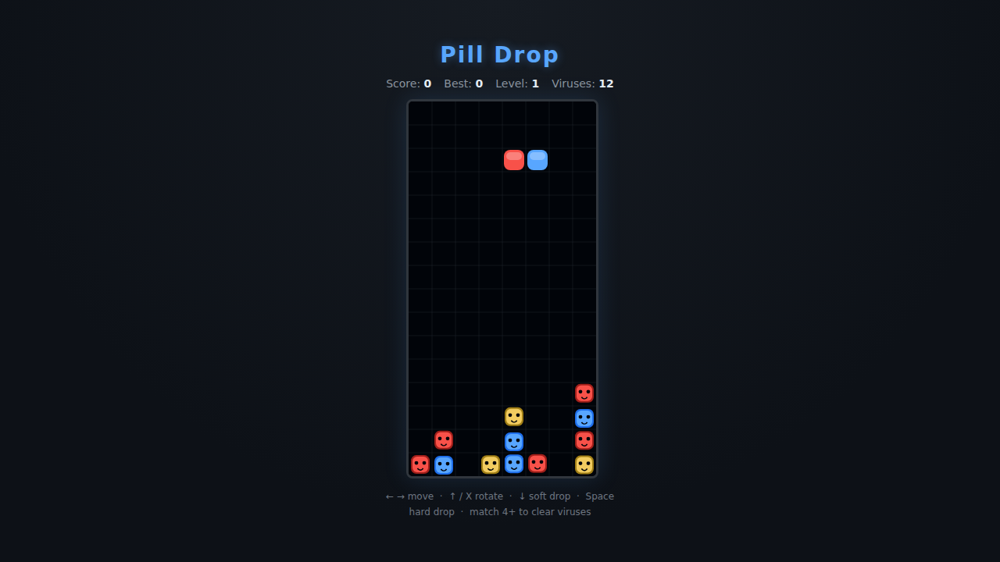

# Pill Drop

Clear the bottle of viruses! Drop two-tone capsules from the top and line up
**four or more** cells of the same colour in a row or column to wipe them out —
including the viruses lurking at the bottom. Clear every virus to advance; let
the capsules stack to the ceiling and it's game over.

A falling-capsule colour-matching puzzle (in the Dr. Mario / Puyo family) built
as an original implementation on an HTML5 canvas.



## How to play

1. Open `index.html` in a browser — no server or build step needed.
2. Press **Start Game** (or **Space**) to begin level 1.
3. Steer each falling capsule so its coloured halves line up with matching
   viruses and settled halves. **Four in a line clears them.**
4. Clear cascades for bonus points. Remove every virus to win the level and
   move on to a tougher one.

### Controls

| Input | Action |
|-------|--------|
| ← / → &nbsp;or&nbsp; **A** / **D** | Move left / right |
| ↑ / **W** / **X** | Rotate clockwise |
| **Z** | Rotate counter-clockwise |
| ↓ / **S** | Soft drop |
| **Space** | Hard drop |
| **P** | Pause / resume |

Your **best** score is saved in the browser between sessions.

## Scoring

- Capsule half cleared: **10 pts**
- Virus cleared: **100 pts × cascade depth** — chains pay off
- Level cleared: **+1000 pts**

## Development

See [`design.md`](design.md) for the internal design and the (documented)
simplifications made. Tests live in
[`tests/pilldrop.spec.js`](tests/pilldrop.spec.js) and run with the repo's
Playwright setup:

```powershell
npx playwright test PillDrop/tests/
```
