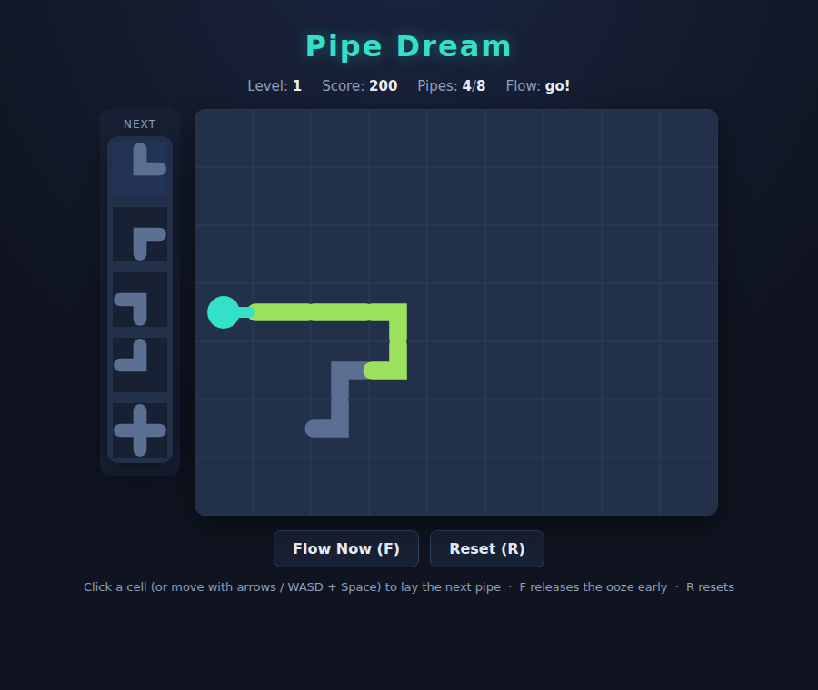

# Pipe Dream

A tile-laying race against the flood. A source spits **ooze** across a grid — lay
down pipe pieces fast enough, and in the right shapes, to build the longest
connected path before the ooze leaks out.

## How to play

1. Press **Start** to begin. A short countdown ticks down before the ooze is
   released.
2. Pieces arrive one at a time in the **Next** queue on the left. The piece at
   the top is the one you place next.
3. **Click any empty cell** to lay that piece there — or move the highlighted
   cursor with the **arrow keys / WASD** and press **Space** (or **Enter**) to
   drop it.
4. Build a continuous run of pipe leading away from the teal **source**. When the
   countdown ends the ooze starts flowing one pipe per tick.
5. Fill the level's **target** number of pipes before the ooze reaches an empty
   cell, the board edge, or a pipe that doesn't line up. Do it and you clear the
   level; leak first and the run ends.

Impatient? Press **F** (or **Flow Now**) to release the ooze early — the sooner
it flows, the fewer pipes you have to lay, but the less room for error.

## Pieces

| Piece | Shape | Connects |
|-------|-------|----------|
| Straight | `──` / `│` | opposite sides |
| Curve | `└ ┌ ┐ ┘` | two adjacent sides |
| Cross | `┼` | all four sides — the ooze passes straight through, and it can be used **twice**, once on each axis |

## Scoring

- **+50** for every pipe the ooze fills.
- **+250** bonus for clearing a level's target.
- Each level raises the target, so paths must get longer as you go.

## Controls

| Input | Action |
|-------|--------|
| Mouse click | Lay the next piece on that cell |
| Arrow keys / WASD | Move the placement cursor |
| Space / Enter | Lay the next piece at the cursor |
| F | Release the ooze immediately |
| R | Reset to level 1 |

## Files

- `index.html` — page layout, canvas, HUD
- `style.css` — presentation
- `game.js` — grid, piece placement, flow simulation, rendering, input
- `DESIGN.md` — how the code and flow model work
- `tests/pipedream.spec.js` — Playwright tests (run with `npm test`)

No build step — open `index.html` in any modern browser.
